<div align="center">
  <p>⚠️🏗️🚧🦺🧱🪵🪨🪚🛠️👷</p>
  <i>This is a working draft in progress.</i>
  <br/>
  
  <br/>
  <blockquote>
	  <!-- <em>The scene is from the series <b>Mr. Robot</b>
    <br/>
    <a href="https://www.usanetwork.com/mr-robot">Mr. Robot Official Site</a></em>
	  <br/> -->
	  <i>gif image is provided by <a href="https://giphy.com">Giphy</a></i>
    <br/>
  </blockquote>
  <p>⚠️🏗️🚧🦺🧱🪵🪨🪚🛠️👷</p>

</div>


# Neural Turing Machines
<details open>
<summary>Click to show/hide the full disclaimer.</summary>
   
> <ins>📢 **Disclaimer** 🚨</ins>
>
> This document contains my personal notes on the topic,
> compiled from publicly available documentation and various cited sources.
> The materials are intended for 👨‍🎓 <ins>educational purposes</ins> 👨‍🎓 (<ins>:trollface:sometimes, entertainment purposes:trollface:</ins>), 📖 <ins> personal study </ins> 📖, and 🔖 <ins> reference </ins> 🔖.
> The content is dual-licensed:
> 1. **MIT License:** Applies to all code implementations (Swift, Mermaid, and other programming languages).
> 2. **Creative Commons Attribution-ShareAlike 4.0 International License (CC BY-SA 4.0):** Applies to all non-code content, including text, explanations, diagrams, and illustrations.

</details>


----

## Neural Turing Machines: A Deep Dive 🚀

This paper introduces the Neural Turing Machine (NTM), a novel architecture that couples a neural network controller with an external memory bank. The key innovation is that the entire system is differentiable end-to-end, allowing it to be trained using gradient descent to learn simple algorithms from input-output examples.

### 1. Introduction: Bridging Learning and Computation 🌉

Traditional computer programs rely on elementary operations, logical flow control, and external memory. While Recurrent Neural Networks (RNNs) are Turing-Complete (Siegelmann and Sontag, 1995), NTMs aim to simplify the learning of algorithmic tasks by providing an explicit, large, addressable memory.

*   **Analogy:** Like Turing enriched finite-state machines with an infinite tape, NTMs enrich RNNs with a large, addressable memory.
*   **Differentiable Computer:** Unlike traditional Turing machines, NTMs can be trained via gradient descent.
*   **Working Memory:** NTMs resemble human working memory, designed for tasks requiring rule-based manipulation of "rapidly-created variables" (Hadley, 2009). They use an attentional process to selectively read/write, similar to a "central executive" (Baddeley et al., 2009).

```mermaid
---
title: "CHANGE_ME_DADDY"
author: "Cong Le"
version: "1.0"
license(s): "MIT, CC BY-SA 4.0"
copyright: "Copyright © 2025 Cong Le. All Rights Reserved."
config:
  layout: elk
  theme: base
  look: handDrawn
---
%%%%%%%% Mermaid version v11.4.1-b.14
%%%%%%%% Available curve styles include the following keywords:
%% basis, bumpX, bumpY, cardinal, catmullRom, linear, monotoneX, monotoneY, natural, step, stepAfter, stepBefore.
%%{
  init: {
    'flowchart': { 'htmlLabels': true, 'curve': 'basis' },
    'fontFamily': 'American Typewriter, monospace',
    'logLevel': 'fatal',
    'themeVariables': {
      'primaryColor': '#22BB',
      'primaryTextColor': '#F8B229',
      'lineColor': '#F8B229',
      'primaryBorderColor': '#27AE60',
      'secondaryColor': '#E2F1',
      'secondaryTextColor': '#6C3483',
      'secondaryBorderColor': '#A569BD',
      'fontSize': '20px'
    }
  }
}%%
flowchart LR
    subgraph Traditional_Computation["Traditional Computation<br/>(Von Neumann, 1945)"]
        TC1["Elementary Operations"]
        TC2["Logical Flow Control"]
        TC3["External Memory"]
    end

    subgraph Machine_Learning["Modern Machine Learning"]
        ML1["Models Complicated Data"]
        ML2("Largely Neglected Flow Control & External Memory")
    end

    subgraph RNNs["Recurrent Neural Networks"]
        RNN1["Turing-Complete<br/>(Siegelmann & Sontag, 1995)"]
        RNN2["Can learn complex transformations"]
        RNN3["Practical learning of algorithms can be hard"]
    end

    subgraph NTM["Neural Turing Machine<br/>(This Paper)"]
        NTM1["Neural Network Controller + External Memory"]
        NTM2["Differentiable End-to-End"]
        NTM3["Learns Algorithms via Gradient Descent"]
        NTM4["Inspired by Working Memory"]
    end

    ML1 --> NTM
    RNNs --> NTM
    TC3 --> NTM1

```



-----

### 2. Foundational Research 📚

The paper draws inspiration from several fields:

*   **Psychology and Neuroscience:** Concepts of working memory, central executive, capacity limitations (Miller, 1956), and neural correlates in prefrontal cortex (Goldman-Rakic, 1995). Models like Hazy et al. (2006) are relevant but often lack sophisticated addressing.
*   **Cognitive Science and Linguistics:** Debates on symbol-processing vs. sub-symbolic descriptions (Rumelhart et al., 1986). Fodor and Pylyshyn's (1988) critiques on variable-binding and variable-length structures in early connectionist models, and subsequent research to address these (Hinton, 1986; Pollack, 1990). The importance of recursive processing for human cognition.
*   **Recurrent Neural Networks:** LSTM (Hochreiter and Schmidhuber, 1997) is a key precursor, addressing vanishing/exploding gradients by using gated memory cells (perfect integrators). RNNs natively handle variable-length structures, leading to successes in speech, text, and translation. Differentiable attention models (Graves, 2013; Bahdanau et al., 2014) are also influential.

----

### 3. Neural Turing Machines: Architecture 🏗️

The NTM consists of a **neural network controller** (which can be feedforward or recurrent, like LSTM) and a **memory bank** (an $N \times M$ matrix, where $N$ is the number of memory locations and $M$ is the vector size at each location). The controller interacts with memory via **read and write heads** using attentional mechanisms.

(Adapted from Figure 1 in the paper)


#### 3.1 Reading 📖

A read head produces a normalized weighting $w_t$ over the $N$ memory locations. The read vector $r_t$ is a convex combination of memory rows $M_t(i)$.

*   Weighting constraints:

	$$
    \sum_i w_t(i) = 1, \quad 0 \leq w_t(i) \leq 1, \forall i
    $$

*   Read vector:

	$$
    r_t \leftarrow \sum_i w_t(i)M_t(i)
    $$

This operation is differentiable with respect to both memory $M_t$ and weighting $w_t$.

#### 3.2 Writing ✍️

Writing is a two-part process: erase then add (inspired by LSTM gates).

1.  **Erase:** Given a weighting $w_t$ and an erase vector $e_t$ (elements in $(0,1)$), previous memory $M_{t-1}(i)$ is modified:

	$$
    \tilde{M}_t(i) \leftarrow M_{t-1}(i) [\mathbf{1} - w_t(i)e_t]
    $$

	(Multiplication is element-wise. $\mathbf{1}$ is a row-vector of ones.) Memory elements are zeroed out if both $w_t(i)$ and $e_t$ components are 1.
2.  **Add:** The head produces an add vector $a_t$, which is added:

	$$
    M_t(i) \leftarrow \tilde{M}_t(i) + w_t(i)a_t
    $$

Both operations are differentiable.

```mermaid
---
title: "CHANGE_ME_DADDY"
author: "Cong Le"
version: "1.0"
license(s): "MIT, CC BY-SA 4.0"
copyright: "Copyright © 2025 Cong Le. All Rights Reserved."
config:
  layout: elk
  theme: base
  look: handDrawn
---
%%%%%%%% Mermaid version v11.4.1-b.14
%%%%%%%% Available curve styles include the following keywords:
%% basis, bumpX, bumpY, cardinal, catmullRom, linear, monotoneX, monotoneY, natural, step, stepAfter, stepBefore.
%%{
  init: {
    'flowchart': { 'htmlLabels': true, 'curve': 'basis' },
    'fontFamily': 'American Typewriter, monospace',
    'logLevel': 'fatal',
    'themeVariables': {
      'primaryColor': '#22BB',
      'primaryTextColor': '#F8B229',
      'lineColor': '#F8B229',
      'primaryBorderColor': '#27AE60',
      'secondaryColor': '#E2F1',
      'secondaryTextColor': '#6C3483',
      'secondaryBorderColor': '#A569BD',
      'fontSize': '20px'
    }
  }
}%%
flowchart LR
    subgraph WriteOperation ["Write Operation Flow"]
        direction LR
        M_prev["M<sub>t-1</sub>(i) <br/> (Previous Memory)"] --> EraseStep
        w_t_write["w<sub>t</sub> <br/> (Write Weighting)"] --> EraseStep
        e_t["e<sub>t</sub> <br/> (Erase Vector)"] --> EraseStep
        EraseStep["Erase <br/> M̃<sub>t</sub>(i) = M<sub>t-1</sub>(i)[1 - w<sub>t</sub>(i)e<sub>t</sub>]"] --> AddStep
        w_t_write --> AddStep
        a_t["a<sub>t</sub> <br/> (Add Vector)"] --> AddStep
        AddStep["Add <br/> M<sub>t</sub>(i) = M̃<sub>t</sub>(i) + w<sub>t</sub>(i)a<sub>t</sub>"] --> M_curr["M<sub>t</sub>(i) <br/> (Current Memory)"]
    end
```



#### 3.3 Addressing Mechanisms 🎯

Weightings $w_t$ are produced by combining content-based and location-based addressing.
(Adapted from Figure 2 in the paper)

```mermaid
---
title: "CHANGE_ME_DADDY"
author: "Cong Le"
version: "1.0"
license(s): "MIT, CC BY-SA 4.0"
copyright: "Copyright © 2025 Cong Le. All Rights Reserved."
config:
  layout: elk
  theme: base
  look: handDrawn
---
%%%%%%%% Mermaid version v11.4.1-b.14
%%%%%%%% Available curve styles include the following keywords:
%% basis, bumpX, bumpY, cardinal, catmullRom, linear, monotoneX, monotoneY, natural, step, stepAfter, stepBefore.
%%{
  init: {
    'flowchart': { 'htmlLabels': true, 'curve': 'basis' },
    'fontFamily': 'American Typewriter, monospace',
    'logLevel': 'fatal',
    'themeVariables': {
      'primaryColor': '#22BB',
      'primaryTextColor': '#F8B229',
      'lineColor': '#F8B229',
      'primaryBorderColor': '#27AE60',
      'secondaryColor': '#E2F1',
      'secondaryTextColor': '#6C3483',
      'secondaryBorderColor': '#A569BD',
      'fontSize': '20px'
    }
  }
}%%
flowchart TD
    A["Input: Memory M<sub>t</sub>, Previous Weighting w<sub>t-1</sub>"] --> B{Controller Produces Parameters}
    B -- "Key k<sub>t</sub>, Strength β<sub>t</sub>" --> C["Content Addressing"]
    C --> D["Compute Similarities K(k<sub>t</sub>, M<sub>t</sub>(j))"]
    D --> E["Compute Content Weighting w<sup>c</sup><sub>t</sub> <br/> Softmax(β<sub>t</sub>K)"]

    B -- "Interpolation Gate g<sub>t</sub>" --> F["Interpolation"]
    E --> F
    G["Previous Weighting w<sub>t-1</sub>"] --> F
    F -- "w<sup>g</sup><sub>t</sub> = g<sub>t</sub>w<sup>c</sup><sub>t</sub> + (1-g<sub>t</sub>)w<sub>t-1</sub>" --> H["Gated Weighting w<sup>g</sup><sub>t</sub>"]

    B -- "Shift Weighting s<sub>t</sub>" --> I["Rotational Shift (Convolution)"]
    H --> I
    I -- "w̃<sub>t</sub>(i) = Σ<sub>j</sub> w<sup>g</sup><sub>t</sub>(j)s<sub>t</sub>(i-j)" --> J["Shifted Weighting w̃<sub>t</sub>"]

    B -- "Sharpening Factor γ<sub>t</sub>" --> K["Sharpening"]
    J --> K
    K -- "w<sub>t</sub>(i) = w̃<sub>t</sub>(i)<sup>γ<sub>t</sub></sup> / Σ<sub>j</sub> w̃<sub>t</sub>(j)<sup>γ<sub>t</sub></sup>" --> L["Final Weighting w<sub>t</sub>"]
    L --> M["Use w<sub>t</sub> for Read/Write"]


    subgraph InputsFromController
        direction LR
        param_kt["k<sub>t</sub> (Key)"]
        param_beta["β<sub>t</sub> (Key Strength)"]
        param_gt["g<sub>t</sub> (Interpolation Gate)"]
        param_st["s<sub>t</sub> (Shift Weighting)"]
        param_gamma["γ<sub>t</sub> (Sharpening)"]
    end
    B --> InputsFromController

    style C fill:#A4F8A4,stroke:#333,stroke-width:1.5px
    style F fill:#A4D3F8,stroke:#333,stroke-width:1.5px
    style I fill:#F8A4A4,stroke:#333,stroke-width:1.5px
    style K fill:#F8E0A4,stroke:#333,stroke-width:1.5px
```



##### 3.3.1 Focusing by Content

*   A key vector $k_t$ (length $M$) is produced by the head.
*   Similarity K($k_t, M_t(i)$) is computed for each memory row $M_t(i)$. Cosine similarity is used:

	$$
    K(u, v) = \frac{u \cdot v}{\|u\| \cdot \|v\|}
    $$

*   A positive key strength $\beta_t$ amplifies/attenuates focus precision.
*   Content weighting $w_t^c$ (normalized):

	$$
    w_t^c(i) \leftarrow \frac{\exp(\beta_t K(k_t, M_t(i)))}{\sum_j \exp(\beta_t K(k_t, M_t(j)))}
    $$

##### 3.3.2 Focusing by Location

Facilitates iteration and random-access jumps via rotational shifts.

1.  **Interpolation:** An interpolation gate $g_t \in (0,1)$ blends the previous head weighting $w_{t-1}$ with the current content weighting $w_t^c$:

	$$
    w_t^g \leftarrow g_t w_t^c + (1-g_t)w_{t-1}
    $$

	If $g_t=0$, $w_{t-1}$ is used. If $g_t=1$, $w_t^c$ is used.
2.  **Rotation (Shift):** The head emits a shift weighting $s_t$ (normalized distribution over allowed integer shifts, e.g., -1, 0, 1). The gated weighting $w_t^g$ is circularly convolved with $s_t$:

	$$
    \tilde{w}_t(i) \leftarrow \sum_{j=0}^{N-1} w_t^g(j) s_t(i-j \pmod N)
    $$

	This can cause dispersion if $s_t$ is not sharp.
3.  **Sharpening:** A scalar $\gamma_t \ge 1$ sharpens the final weighting:

	$$
    w_t(i) \leftarrow \frac{(\tilde{w}_t(i))^{\gamma_t}}{\sum_j (\tilde{w}_t(j))^{\gamma_t}}
    $$

**Combined Addressing Modes:**
1.  Content-based only (no location modification).
2.  Content-based lookup followed by a shift (e.g., find data block, access element within).
3.  Rotation of previous weighting (iterate through addresses).

#### 3.4 Controller Network 🧠⚙️

*   **Feedforward Controller:**
	*   Simpler, easier to interpret memory access patterns.
	*   Memory acts as its state.
	*   Number of read/write heads can be a bottleneck (e.g., 1 read head = unary transform per step).
*   **Recurrent Controller (e.g., LSTM):**
	*   Has internal memory (hidden activations, like CPU registers) complementing the external memory matrix (RAM).
	*   Can mix information across multiple time steps.
	*   Can overcome head bottleneck by storing read vectors internally from previous steps.

----

### 4. Experiments 🔬📊

The paper tests NTM on several algorithmic tasks, comparing NTM (with feedforward/LSTM controller) against a standard LSTM network. The goal is to see if NTMs learn compact internal programs that generalize well. Errors are reported in bits-per-sequence using cross-entropy.

#### 4.1 Copy Task 📋

*   **Task:** Store and recall a sequence of random 8-bit vectors (length 1-20) after a delimiter.
*   **Results:** NTMs learned much faster and converged to lower cost than LSTM (Figure 3). NTMs generalized to much longer sequences (e.g., length 100) while LSTM degraded rapidly beyond length 20 (Figures 4, 5).
*   **Learned Algorithm (Figure 6):**


This uses both content-based addressing (to jump to start) and location-based addressing (to iterate). Relies on relative shifts (Eq. 7) and sharpening (Eq. 9) for generalization.

#### 4.2 Repeat Copy Task 🔁📋

*   **Task:** Output a copied sequence a specified number of times, then an end-of-sequence marker. Tests nested function learning ("for loop").
*   **Input:** Random-length sequences + scalar for number of repeats (1-10).
*   **Results:** NTM learned faster than LSTM; both solved it (Figure 7). NTM generalized better to longer sequences and more repetitions but struggled to predict the END marker correctly for many >10 repetitions (Figure 8).
*   **Learned Algorithm (Figure 9):** An extension of the copy algorithm, where the sequential read is repeated. A "goto" like mechanism (intermediate location) used to reset head to sequence start.

#### 4.3 Associative Recall Task 🔗

*   **Task:** Store a list of items (sequences of 3 6-bit vectors, bounded by delimiters). Given a query item, return the next item in the list. Tests indirection.
*   **Training:** 2-6 items per episode.
*   **Results:** NTM learned significantly faster than LSTM (Figure 10). NTM with feedforward controller was fastest. NTM generalized better to longer item sequences (Figure 11).
*   **Learned Algorithm (Figure 12):**
	1.  When item delimiter is presented, controller writes a compressed representation of the previous item to a memory location.
	2.  After query, controller recomputes compressed representation of the query item.
	3.  Uses content-based lookup to find where the first representation was stored.
	4.  Shifts by one (location-based offset) to read the next item. (Combines content lookup + location offset).

#### 4.4 Dynamic N-Grams Task 🎲

*   **Task:** Adapt rapidly to new predictive distributions. Predict the next bit in a sequence generated from a randomly drawn 6-Gram distribution.
*   **Optimal Estimator:** Bayesian predictor: $P(B=1|N_1, N_0, c) = (N_1 + 1/2) / (N_1 + N_0 + 1)$.
*   **Results:** NTM performed slightly better than LSTM, but not as well as the optimal estimator (Figure 13). NTM predictions were closer to optimal than LSTM (Figure 14).
*   **Learned Algorithm (Figure 15):** NTM uses memory to count observed ones/zeros for different contexts (5-bit histories), emulating the N-Gram table. It accesses the same location for the same context to update/read counts. Writes seemed to record a ratio rather than absolute counts.

#### 4.5 Priority Sort Task 🥇🥈🥉

*   **Task:** Sort a sequence of random binary vectors based on associated scalar priorities. Output the 16 highest-priority vectors.
*   **Input:** 20 binary vectors + priorities (uniform in [-1, 1]).
*   **Results:** NTMs (both controller types) substantially outperformed LSTM (Figure 18). Feedforward NTM needed 8 parallel heads for best performance.
*   **Learned Algorithm (Figure 17):**
	1.  NTM uses priorities to determine the relative write location for each item (linear function of priority).
	2.  Reads from memory locations in increasing order to retrieve the sorted sequence.

#### 4.6 Experimental Details 🛠️

*   Optimizer: RMSProp (Graves, 2013) with momentum 0.9.
*   Gradients clipped to (-10, 10).
*   Tables 1-3 in the paper detail network configurations, memory sizes (typically 128 locations x 20 dimensions), learning rates, and parameter counts. LSTM parameter counts grow quadratically with hidden units, NTMs do not with memory locations.

----

### 5. Conclusion 🎉

The Neural Turing Machine:
*   Is a neural network architecture inspired by biological working memory and digital computer design.
*   Is differentiable end-to-end and trainable with gradient descent.
*   Can learn simple algorithms from example data.
*   Can generalize these algorithms well beyond its training regime.

This work opens exciting possibilities for neural networks to learn more complex procedural tasks. 👍

----

<div align="center">
	
	<br/>
	<em>Use knowledge wisely. gif image is provided by <a href="https://giphy.com">Giphy</a></em>
</div>

----

```mermaid
---
title: "❓...CongLeSolutionX....❓"
author: "Cong Le"
version: "1.0"
license(s): "MIT, CC BY-SA 4.0"
copyright: "Copyright (c) 2025 Cong Le. All Rights Reserved."
config:
  theme: base
---
%%%%%%%% Mermaid version v11.4.1-b.14
%%{
  init: {
    'flowchart': { 'htmlLabels': false },
    'fontFamily': 'Bradley Hand',
    'themeVariables': {
      'primaryColor': '#fc82',
      'primaryTextColor': '#F8B229',
      'primaryBorderColor': '#27AE60',
      'secondaryColor': '#5229',
      'secondaryTextColor': '#6C3483',
      'lineColor': '#F8B229',
      'fontSize': '20px'
    }
  }
}%%
flowchart LR
    My_Meme@{ img: "https://raw.githubusercontent.com/CongLeSolutionX/CongLeSolutionX/refs/heads/main/assets/images/My-meme-and-question-marks-open-book-old-characters-background.png", label: "..👀..🤐..📖..", pos: "b", w: 200, h: 150, constraint: "off" }
   
    Link_to_my_profile{{"<a href='https://github.com/CongLeSolutionX' target='_blank'>Click here if you care about my profile</a>"}}

  Closing_quote@{ shape: braces, label: "..👀..🤫..📚.."}

   Closing_quote ~~~ My_Meme

    My_Meme animatingEdge@--> Link_to_my_profile
  
  animatingEdge@{ animate: true }

```

---
>**Licenses:**
>
>- **MIT License:**  [](LICENSE) - Full text in [LICENSE](LICENSE) file.
>- **Creative Commons Attribution-ShareAlike 4.0 International**: [CC BY-SA 4.0](https://creativecommons.org/licenses/by-sa/4.0/) [](https://creativecommons.org/licenses/by-sa/4.0/) - Legal details in [LICENSE-CC-BY-SA-4.0](THE_PAST/LICENSE-CC-BY-SA-4.0) and at [Creative Commons official site](https://creativecommons.org/licenses/by-sa/4.0/).
>
---

### References 📜

(Selected, as in the paper. Full list in the original document.)

*   Baddeley, A., Eysenck, M., and Anderson, M. (2009). *Memory*. Psychology Press.
*   Bahdanau, D., Cho, K., and Bengio, Y. (2014). Neural machine translation by jointly learning to align and translate. *arXiv:1409.0473*.
*   Fodor, J. A. and Pylyshyn, Z. W. (1988). Connectionism and cognitive architecture: A critical analysis. *Cognition*, 28(1):3–71.
*   Graves, A. (2013). Generating sequences with recurrent neural networks. *arXiv:1308.0850*.
*   Hadley, R. F. (2009). The problem of rapid variable creation. *Neural computation*, 21(2):510–532.
*   Hochreiter, S. and Schmidhuber, J. (1997). Long short-term memory. *Neural computation*, 9(8):1735–1780.
*   Miller, G. A. (1956). The magical number seven, plus or minus two: some limits on our capacity for processing information. *Psychological review*, 63(2):81.
*   Siegelmann, H. T. and Sontag, E. D. (1995). On the computational power of neural nets. *Journal of computer and system sciences*, 50(1):132–150.
*   Von Neumann, J. (1945). First draft of a report on the edvac.

-----
