<div align="center">
  <p>⚠️🏗️🚧🦺🧱🪵🪨🪚🛠️👷</p>
  <i>This is a working draft in progress.</i>
  <br/>
  
  <br/>
  <blockquote>
	  <!-- <em>The scene is from the series <b>Mr. Robot</b>
    <br/>
    <a href="https://www.usanetwork.com/mr-robot">Mr. Robot Official Site</a></em>
	  <br/> -->
	  <i>gif image is provided by <a href="https://giphy.com">Giphy</a></i>
    <br/>
  </blockquote>
  <p>⚠️🏗️🚧🦺🧱🪵🪨🪚🛠️👷</p>

</div>


# Neural Turing Machines
<details open>
<summary>Click to show/hide the full disclaimer.</summary>
   
> <ins>📢 **Disclaimer** 🚨</ins>
>
> This document contains my personal notes on the topic,
> compiled from publicly available documentation and various cited sources.
> The materials are intended for 👨‍🎓 <ins>educational purposes</ins> 👨‍🎓 (<ins>:trollface:sometimes, entertainment purposes:trollface:</ins>), 📖 <ins> personal study </ins> 📖, and 🔖 <ins> reference </ins> 🔖.
> The content is dual-licensed:
> 1. **MIT License:** Applies to all code implementations (Swift, Mermaid, and other programming languages).
> 2. **Creative Commons Attribution-ShareAlike 4.0 International License (CC BY-SA 4.0):** Applies to all non-code content, including text, explanations, diagrams, and illustrations.

</details>


----

## **Citation Reference**

> Graves, A., Wayne, G., & Danihelka, I. (2014). *Neural Turing Machines*. arXiv preprint arXiv:1410.5401.

---

## 🗺️ An Overview: What is a Neural Turing Machine?

At its core, a Neural Turing Machine (NTM) enhances a standard neural network with an external memory bank. This allows the network to learn to store and retrieve information, effectively learning simple programs or algorithms from examples alone. The entire system is differentiable, which means it can be trained from end-to-end using gradient descent.

Here's a mind map of the key ideas and their relationships:


---

## 🏗️ The NTM Architecture

The NTM consists of two main parts: the **Controller** and the **Memory**. The controller is the brain, and the memory is its notepad. It interacts with this notepad using **Read and Write Heads**.

```mermaid
---
title: "🏗️ The NTM Architecture"
author: "Cong Le"
version: "1.0"
license(s): "MIT, CC BY-SA 4.0"
copyright: "Copyright © 2025 Cong Le. All Rights Reserved."
config:
  layout: elk
  theme: base
  look: handDrawn
---
%%%%%%%% Mermaid version v11.4.1-b.14
%%%%%%%% Available curve styles include the following keywords:
%% basis, bumpX, bumpY, cardinal, catmullRom, linear, monotoneX, monotoneY, natural, step, stepAfter, stepBefore.
%%{
  init: {
    'flowchart': { 'htmlLabels': true, 'curve': 'basis' },
    'fontFamily': 'American Typewriter, monospace',
    'logLevel': 'fatal',
    'themeVariables': {
      'primaryColor': '#22BB',
      'primaryTextColor': '#F8B229',
      'lineColor': '#F8B229',
      'primaryBorderColor': '#27AE60',
      'secondaryColor': '#E2F1',
      'secondaryTextColor': '#6C3483',
      'secondaryBorderColor': '#A569BD',
      'fontSize': '20px'
    }
  }
}%%
flowchart TD
    subgraph External_World
        Input[Input Vector] --> Controller;
        Controller --> Output[Output Vector];
    end

    subgraph NTM
        style NTM fill:#f9f,stroke:#333,stroke-width:2px,stroke-dasharray: 5 5

        Controller(🧠<br>Controller<br>Feedforward or LSTM)
        Memory(💾<br>Memory Matrix<br>N locations x M dimensions)

        Controller -- "Head Parameters" --> ReadHead["Read Head"];
        Controller -- "Head Parameters" --> WriteHead["Write Head"];

        ReadHead -- "Read Weighting w_t" --> Memory;
        Memory -- "Read Vector r_t" --> ReadHead;
        ReadHead -- "r_t" --> Controller

        WriteHead -- "Write Weighting w_t" --> Memory;
    end

    linkStyle 0,1,2,3,4,5,6,7 stroke-width:2px;
```



*   The **Controller** (a neural network) receives external input and produces external output.
*   Crucially, it also emits parameters that control the **Read and Write Heads**.
*   These heads interact with the **Memory Matrix**, which is just a table of numbers (vectors).
*   The interaction isn't sharp like in a digital computer; it's "blurry" or "attentional," defined by a weighting over all memory locations.

---

## 📖 Reading and Writing: The Core Operations

The heads don't point to a single memory address. Instead, they use a normalized weighting vector, $\mathbf{w}_t$, where each element $w_t(i)$ represents the head's focus on memory location $i$.

### Reading 👓

The read vector, $\mathbf{r}_t$, is a convex combination of all memory rows, $\mathbf{M}_t(i)$, weighted by the attention distribution $\mathbf{w}_t$.

$$
\mathbf{r}_t \leftarrow \sum_{i=1}^{N} w_t(i) \mathbf{M}_t(i)
$$

Where:
*   $\mathbf{M}_t$ is the `N x M` memory matrix at time `t`.
*   $w_t(i)$ is the scalar weight on memory location `i`.
*   This process is fully differentiable.

### Writing 🖊️

Writing is a two-step process inspired by the gates in an LSTM cell: **erase** and then **add**.

1.  **Erase:** The write head produces an *erase vector* $\mathbf{e}_t$ (with elements between 0 and 1). This vector is used to selectively erase bits from the memory locations it's focused on.

	$$
    \tilde{\mathbf{M}}_t(i) \leftarrow \mathbf{M}_{t-1}(i) \odot [\mathbf{1} - w_t(i)\mathbf{e}_t]
    $$

2.  **Add:** The write head then produces an *add vector* $\mathbf{a}_t$, which is added to the memory.

	$$
    \mathbf{M}_t(i) \leftarrow \tilde{\mathbf{M}}_t(i) + w_t(i) \mathbf{a}_t
    $$

Here, $\odot$ denotes element-wise multiplication. This two-part mechanism gives the controller fine-grained control to modify memory content.

---

## 🎯 The Heart of the Machine: Addressing Mechanisms

This is the most ingenious part of the NTM. How does the controller generate the weighting $\mathbf{w}_t$ to focus its attention? It combines two complementary systems.

Here is a flow diagram of the entire process:


Let's break down each step:

1.  **Focusing by Content:** The controller generates a key $\mathbf{k}_t$ and asks the memory: "Which of you looks most like this key?"
	*   Similarity is calculated (e.g., Cosine Similarity) between $\mathbf{k}_t$ and each memory row $\mathbf{M}_t(i)$.
	*   The key strength $\beta_t$ amplifies or softens these similarities.
	*   A `softmax` function normalizes these scores into a content-based weighting $\mathbf{w}^c_t$.

	$$
    w^c_t(i) \leftarrow \frac{\exp(\beta_t K(\mathbf{k}_t, \mathbf{M}_t(i)))}{\sum_j \exp(\beta_t K(\mathbf{k}_t, \mathbf{M}_t(j)))}
    $$

2.  **Interpolation:** The system then decides how much to rely on this new content-based focus versus the focus it had at the *previous timestep* ($\mathbf{w}_{t-1}$). The interpolation gate $g_t$ controls this blend.

	$$
    \mathbf{w}^g_t \leftarrow g_t \mathbf{w}^c_t + (1 - g_t) \mathbf{w}_{t-1}
    $$

	*   This is crucial for iterative tasks. By setting $g_t=0$, the NTM can ignore the content and just use its previous focus.

3.  **Rotational Shift:** Next, the system can perform a circular shift on the weighting. The shift weighting $\mathbf{s}_t$ defines a distribution over possible integer shifts (e.g., -1, 0, 1). This is how the NTM moves sequentially through memory.

	$$
    \tilde{w}_t(i) \leftarrow \sum_{j=0}^{N-1} w^g_t(j) s_t(i-j)
    $$

	*   This is a circular convolution, allowing the head to move "one step forward" or "three steps back."

4.  **Sharpening:** Finally, to prevent the weighting from becoming blurry after repeated shifts, a sharpening factor $\gamma_t \ge 1$ is applied.

	$$
    w_t(i) \leftarrow \frac{\tilde{w}_t(i)^{\gamma_t}}{\sum_j \tilde{w}_t(j)^{\gamma_t}}
    $$

This combined mechanism allows the NTM to:
*   Jump to a location based on its content (`gt=1`).
*   Iterate through memory locations (`gt=0` and shifting).
*   Find an item by content and then access its neighbor (a combination of both).

---

## 🚀 NTMs in Action: Learning Algorithms

The paper tests NTMs on several tasks to see if they can learn algorithmic solutions. In all cases, they significantly outperform standard LSTMs, especially in generalizing to longer sequences.

### 1. Copy Task

*   **Goal:** Read a sequence of vectors and then reproduce it.
*   **Learned Algorithm:** The NTM learns a classic array-copying routine.


*   **How:** During the input phase, it writes each vector to a new memory location by using location-based shifting (`gt=0`, `st(1)=1`). For the output phase, it jumps back to the start (using content-addressing on a start-of-sequence marker or by remembering the start location) and iterates through the same locations to read the vectors back.

### 2. Associative Recall

*   **Goal:** Store a sequence of items, e.g., (A, B), (B, C), (C, D). When queried with `B`, return `C`.
*   **Learned Algorithm:** A form of pointer-following.
*   **How:** The NTM learns to store each item, but crucially, when it sees the delimiter between items (e.g., between `item_i` and `item_{i+1}`), it writes a *compressed representation* of `item_i` to a single memory slot. When it gets a query `Q`:
	1.  It computes the same compressed representation for `Q`.
	2.  It uses **content addressing** to find the memory location where this representation was stored.
	3.  It then uses a **location-based shift** of `+1` to move to the next slot, which contains the subsequent item, and reads it.

### 3. Priority Sort

*   **Goal:** Given a sequence of vectors each with a priority score, output the vectors sorted by that score.
*   **Learned Algorithm:** A form of bucket or radix sort.


*   **How:** The NTM learns a linear mapping where the scalar priority directly determines the memory location for the write. A high priority means a high memory address, and a low priority means a low address. To output the sorted list, it simply starts at the lowest memory address and reads sequentially upwards.

---

## 🤔 Conclusion and Lasting Impact

The Neural Turing Machine was a landmark paper because it demonstrated that it's possible to create a neural architecture that can learn simple, human-readable algorithms purely from examples.

*   ✅ **Generalization:** By learning the underlying algorithm, NTMs generalize far better to longer sequences than standard RNNs, which tend to just memorize patterns.
*   ✅ **Interpretability:** The memory interactions are often easy to visualize and interpret, giving us a window into *how* the network is solving the problem.
*   ✅ **Foundation:** This work paved the way for more advanced memory-augmented networks like the Differentiable Neural Computer (DNC) and Memory Networks, which are critical steps toward building systems that can reason and perform complex, multi-step tasks.

-----

<div align="center">
	
	<br/>
	<em>Use knowledge wisely. gif image is provided by <a href="https://giphy.com">Giphy</a></em>
</div>

----

```mermaid
---
title: "❓...CongLeSolutionX....❓"
author: "Cong Le"
version: "1.0"
license(s): "MIT, CC BY-SA 4.0"
copyright: "Copyright (c) 2025 Cong Le. All Rights Reserved."
config:
  theme: base
---
%%%%%%%% Mermaid version v11.4.1-b.14
%%{
  init: {
    'flowchart': { 'htmlLabels': false },
    'fontFamily': 'Bradley Hand',
    'themeVariables': {
      'primaryColor': '#fc82',
      'primaryTextColor': '#F8B229',
      'primaryBorderColor': '#27AE60',
      'secondaryColor': '#5229',
      'secondaryTextColor': '#6C3483',
      'lineColor': '#F8B229',
      'fontSize': '20px'
    }
  }
}%%
flowchart LR
    My_Meme@{ img: "https://raw.githubusercontent.com/CongLeSolutionX/CongLeSolutionX/refs/heads/main/assets/images/My-meme-and-question-marks-open-book-old-characters-background.png", label: "..👀..🤐..📖..", pos: "b", w: 200, h: 150, constraint: "off" }
   
    Link_to_my_profile{{"<a href='https://github.com/CongLeSolutionX' target='_blank'>Click here if you care about my profile</a>"}}

  Closing_quote@{ shape: braces, label: "..👀..🤫..📚.."}

   Closing_quote ~~~ My_Meme

    My_Meme animatingEdge@--> Link_to_my_profile
  
  animatingEdge@{ animate: true }

```

---
>**Licenses:**
>
>- **MIT License:**  [](LICENSE) - Full text in [LICENSE](LICENSE) file.
>- **Creative Commons Attribution-ShareAlike 4.0 International**: [CC BY-SA 4.0](https://creativecommons.org/licenses/by-sa/4.0/) [](https://creativecommons.org/licenses/by-sa/4.0/) - Legal details in [LICENSE-CC-BY-SA-4.0](THE_PAST/LICENSE-CC-BY-SA-4.0) and at [Creative Commons official site](https://creativecommons.org/licenses/by-sa/4.0/).
>
---
