<div align="center">
  <p>⚠️🏗️🚧🦺🧱🪵🪨🪚🛠️👷</p>
  <i>This is a working draft in progress.</i>
  <br/>
  
  <br/>
  <blockquote>
	  <!-- <em>The scene is from the series <b>Mr. Robot</b>
    <br/>
    <a href="https://www.usanetwork.com/mr-robot">Mr. Robot Official Site</a></em>
	  <br/> -->
	  <i>gif image is provided by <a href="https://giphy.com">Giphy</a></i>
    <br/>
  </blockquote>
  <p>⚠️🏗️🚧🦺🧱🪵🪨🪚🛠️👷</p>

</div>


# Order Matters: Sequence to Sequence for Sets
<details open>
<summary>Click to show/hide the full disclaimer.</summary>
   
> <ins>📢 **Disclaimer** 🚨</ins>
>
> This document contains my personal notes on the topic,
> compiled from publicly available documentation and various cited sources.
> The materials are intended for 👨‍🎓 <ins>educational purposes</ins> 👨‍🎓 (<ins>:trollface:sometimes, entertainment purposes:trollface:</ins>), 📖 <ins> personal study </ins> 📖, and 🔖 <ins> reference </ins> 🔖.
> The content is dual-licensed:
> 1. **MIT License:** Applies to all code implementations (Swift, Mermaid, and other programming languages).
> 2. **Creative Commons Attribution-ShareAlike 4.0 International License (CC BY-SA 4.0):** Applies to all non-code content, including text, explanations, diagrams, and illustrations.

</details>


----

## 📝 Abstract Summary

The paper highlights that while Recurrent Neural Networks (RNNs) and the seq2seq framework have revolutionized tasks involving sequences, many real-world problems deal with variable-sized inputs/outputs that don't have a natural order (i.e., they are sets). The authors:
1.  Demonstrate that the chosen order of input/output data significantly impacts model learning, even when no natural order exists.
2.  Propose an extension to seq2seq to handle input sets in a principled, permutation-invariant way.
3.  Introduce a novel loss function that deals with the lack of structure in output sets by searching over possible orderings during training.
Empirical evidence is provided from language modeling, parsing, sorting numbers, and modeling joint probabilities of graphical models.

---

## 🧐 The Core Problem: Sequences vs. Sets

Traditional seq2seq models excel when inputs ($X$) and outputs ($Y$) are sequences. They leverage the chain rule to model the joint probability $P(Y|X)$:

$$
P(Y|X) = \prod_{t=1}^{T} P(y_t | y_1, y_2, \ldots, y_{t-1}, X)
$$

This is typically implemented with an encoder RNN reading $X$ and a decoder RNN generating $Y$.

```mermaid
---
title: "🧐 The Core Problem: Sequences vs. Sets"
author: "Cong Le"
version: "1.0"
license(s): "MIT, CC BY-SA 4.0"
copyright: "Copyright © 2025 Cong Le. All Rights Reserved."
config:
  layout: elk
  theme: base
  look: handDrawn
---
%%%%%%%% Mermaid version v11.4.1-b.14
%%%%%%%% Available curve styles include the following keywords:
%% basis, bumpX, bumpY, cardinal, catmullRom, linear, monotoneX, monotoneY, natural, step, stepAfter, stepBefore.
%%{
  init: {
    'flowchart': { 'htmlLabels': true, 'curve': 'basis' },
    'fontFamily': 'American Typewriter, monospace',
    'logLevel': 'fatal',
    'themeVariables': {
      'primaryColor': '#22BB',
      'primaryTextColor': '#F8B229',
      'lineColor': '#F8B229',
      'primaryBorderColor': '#27AE60',
      'secondaryColor': '#E2F1',
      'secondaryTextColor': '#6C3483',
      'secondaryBorderColor': '#A569BD',
      'fontSize': '20px'
    }
  }
}%%
flowchart LR
    subgraph Encoder["Encoder"]
    direction LR
        X1[x₁] --> EncRNN["RNN/LSTM State h₁"]
        EncRNN -- h₁ --> EncRNN2["RNN/LSTM State h₂"]
        X2[x₂] --> EncRNN2
        XN[xₙ] -.-> EncRNN_S["RNN/LSTM State h<sub>S</sub>"]
    end

    EncRNN_S --> C["Context Vector c (e.g., h<sub>S</sub>)"]

    subgraph Decoder["Decoder"]
    direction LR
        C --> DecRNN["RNN/LSTM State g₁"]
        SOS["<sos>"] --> DecRNN
        DecRNN --> Y1_P["P(y₁|c)"] --> Y1[y₁]
        Y1 --> DecRNN2["RNN/LSTM State g₂"]
        DecRNN2 --> Y2_P["P(y₂|y₁,c)"] --> Y2[y₂]
        YN["y<sub>t-1</sub>"] --> DecRNN_T["RNN/LSTM State g<sub>t</sub>"]
        DecRNN_T --> YM_P["P(y<sub>t</sub>|y₁..y<sub>t-1</sub>,c)"] --> YM["y<sub>t</sub>"]
    end
    style EncRNN fill:#lightgrey,stroke:#333,stroke-width:2px
    style DecRNN fill:#lightgrey,stroke:#333,stroke-width:2px
    style C fill:#lightblue,stroke:#333,stroke-width:2px
```



*Figure 1: Basic Sequence-to-Sequence (Seq2Seq) Architecture.*

**The Challenge ❓:**
*   How do we input a set of numbers $\{3, 1, 4\}$ to be sorted if the input order `(3,1,4)` vs `(1,4,3)` should ideally yield the same internal representation before sorting?
*   How do we output a set of detected objects if there's no canonical order?
*   Does the arbitrary order we impose on these sets affect learning? (Spoiler: Yes! 👇)

---

## 📥 Handling Input Sets

The paper argues that for input sets, the model should be **permutation invariant**: swapping two elements $x_i$ and $x_j$ in the input set $X$ should not change its encoding.
While simple methods like bag-of-words achieve this, they are often inefficient and don't scale well with set size.

### 🌪️ Input Order Matters: Empirical Evidence

The authors point out several instances where input order affected seq2seq performance:
*   **Machine Translation**: Reversing the source sentence improved BLEU score by 5.0 points (Sutskever et al., 2014).
*   **Constituency Parsing**: Reversing the input sentence yielded a 0.5% F1 score increase (Vinyals et al., 2015b).
*   **Convex Hull Computation**: Sorting input points by angle simplified the problem and improved accuracy by up to 10% (Vinyals et al., 2015a).

These suggest that specific orderings can create more favorable optimization landscapes or provide better priors.

### 💡 Proposed Solution: Read, Process, Write Architecture

To handle input sets in a principled way, the paper proposes a model inspired by Memory Networks and Neural Turing Machines. This architecture (Figure 1 in the paper) has three main components:

```mermaid
---
title: "💡 Proposed Solution: Read, Process, Write Architecture"
author: "Cong Le"
version: "1.0"
license(s): "MIT, CC BY-SA 4.0"
copyright: "Copyright © 2025 Cong Le. All Rights Reserved."
config:
  layout: elk
  theme: base
  look: handDrawn
---
%%%%%%%% Mermaid version v11.4.1-b.14
%%%%%%%% Available curve styles include the following keywords:
%% basis, bumpX, bumpY, cardinal, catmullRom, linear, monotoneX, monotoneY, natural, step, stepAfter, stepBefore.
%%{
  init: {
    'flowchart': { 'htmlLabels': true, 'curve': 'basis' },
    'fontFamily': 'American Typewriter, monospace',
    'logLevel': 'fatal',
    'themeVariables': {
      'primaryColor': '#22BB',
      'primaryTextColor': '#F8B229',
      'lineColor': '#F8B229',
      'primaryBorderColor': '#27AE60',
      'secondaryColor': '#E2F1',
      'secondaryTextColor': '#6C3483',
      'secondaryBorderColor': '#A569BD',
      'fontSize': '20px'
    }
  }
}%%
flowchart TD
    subgraph InputSet["Input Set X = {xᵢ}"]
        style InputSet fill:#E6E6FA,stroke:#333,stroke-width:2px
        x1_node["x₁ (e.g., number)"]
        x2_node["x₂"]
        xn_node["... x<sub>N</sub>"]
    end

    subgraph ReadBlock["📖 Read Block: Embed Elements"]
        style ReadBlock fill:#ADD8E6,stroke:#333,stroke-width:2px
        x1_node --> Embed1["Embed x₁ ➔ m₁ (memory vector)"]
        x2_node --> Embed2["Embed x₂ ➔ m₂"]
        xn_node --> EmbedN["Embed x<sub>N</sub> ➔ m<sub>N</sub>"]
        Embed1 & Embed2 & EmbedN --> Memories["Memories M = {mᵢ}"]
    end

    subgraph ProcessBlock["⚙️ Process Block: Permutation-Invariant Encoding"]
        style ProcessBlock fill:#90EE90,stroke:#333,stroke-width:2px
        Memories --> PB_LSTM{"LSTM iterating T 'processing steps'"}
        PB_LSTM -- "uses Attention over M" --> PB_LSTM
        PB_LSTM --> q_Tast["Hidden State q*<sub>T</sub> (permutation-invariant encoding of X)"]
    end

    subgraph WriteBlock["✍️ Write Block: Generate Output"]
        style WriteBlock fill:#FFDAB9,stroke:#333,stroke-width:2px
        q_Tast --> WB_LSTM{"Decoder (e.g., LSTM Pointer Network)"}
        Memories -- "for pointing if needed" --> WB_LSTM
        WB_LSTM -- "Outputs y₁, y₂, ..." --> OutputSeq["Output Sequence/Set Representation"]
    end

    InputSet --> ReadBlock
    ReadBlock --> ProcessBlock
    ProcessBlock --> WriteBlock
```



*Figure 2: The Read-Process-Write Model Architecture for Input Sets.*

1.  **Read Block**: Embeds each element $x_i \in X$ into a memory vector $m_i$ using a shared neural network.
2.  **Process Block**: An LSTM performs $T$ "processing steps". In each step, it updates its state by attending to the memory vectors $M = \{m_i\}$. This attention mechanism is key to permutation invariance. The final hidden state $q^*_T$ is an encoding of the input set.
3.  **Write Block**: A decoder (e.g., an LSTM Pointer Network if outputs are from the input set) takes $q^*_T$ and produces the output.

#### ✨ Attention Mechanism in the Process Block

The "content-based" attention mechanism ensures that shuffling memories $m_i$ doesn't change the retrieved information $r_t$.
For each processing step $t=1, \dots, T$:
1.  Query generation: $q_t = \text{LSTM}(q^*_{t-1})$ (LSTM takes no direct input other than its previous state)
2.  Energy computation: $e_{i,t} = f(m_i, q_t)$ (e.g., dot product, or a small MLP)
3.  Attention weights (softmax): $a_{i,t} = \frac{\exp(e_{i,t})}{\sum_j \exp(e_{j,t})}$
4.  Readout vector: $r_t = \sum_i a_{i,t} m_i$
5.  Next LSTM state input: $q^*_t = [q_t ; r_t]$ (concatenation)

The final $q^*_T$ is then passed to the Write block.

```mermaid
---
title: "✨ Attention Mechanism in the Process Block"
author: "Cong Le"
version: "1.0"
license(s): "MIT, CC BY-SA 4.0"
copyright: "Copyright © 2025 Cong Le. All Rights Reserved."
config:
  layout: elk
  theme: base
  look: handDrawn
---
%%%%%%%% Mermaid version v11.4.1-b.14
%%%%%%%% Available curve styles include the following keywords:
%% basis, bumpX, bumpY, cardinal, catmullRom, linear, monotoneX, monotoneY, natural, step, stepAfter, stepBefore.
%%{
  init: {
    'flowchart': { 'htmlLabels': true, 'curve': 'basis' },
    'fontFamily': 'American Typewriter, monospace',
    'logLevel': 'fatal',
    'themeVariables': {
      'primaryColor': '#22BB',
      'primaryTextColor': '#F8B229',
      'lineColor': '#F8B229',
      'primaryBorderColor': '#27AE60',
      'secondaryColor': '#E2F1',
      'secondaryTextColor': '#6C3483',
      'secondaryBorderColor': '#A569BD',
      'fontSize': '20px'
    }
  }
}%%
flowchart TD
    q_prev_star["Input: Prev. State q*<sub>t-1</sub>"] --> LSTM_q["LSTM Cell"]
    LSTM_q --> q_t["Query q<sub>t</sub>"]

    subgraph ForEachMemory_m_i["For each memory mᵢ ∈ M"]
      q_t --> f_mi_qt["f(mᵢ, q<sub>t</sub>)"]
      f_mi_qt --> e_it["Energy e<sub>i,t</sub>"]
    end
    
    e_it --> Softmax["Softmax over all e<sub>j,t</sub>"]
    Softmax --> a_it["Attention Weights a<sub>i,t</sub>"]

    subgraph WeightedSum["Compute Readout r<sub>t</sub>"]
        a_it --> Multiply_a_m["a<sub>i,t</sub> * mᵢ"]
        Multiply_a_m --> Sum_am["Σ (a<sub>j,t</sub> * m<sub>j</sub>)"]
        Sum_am --> r_t["Readout r<sub>t</sub>"]
    end
    
    q_t --> Concat["Concatenate"]
    r_t --> Concat
    Concat --> q_t_star["Output: New State q*<sub>t</sub>"]
    
    style LSTM_q fill:#lightgreen,stroke:#333
    style q_t_star fill:#lightgreen,stroke:#333
```



*Figure 3: Flow of the Attention Mechanism for one processing step $t$ in the Process Block.*

### 📊 Sorting Experiment (Input Sets)

Task: Sort $N$ random floating-point numbers. This is a set-to-sequence task.
Compared:
*   **Ptr-Net (Baseline seq2seq)**: LSTM encoder + Pointer Network decoder.
*   **Read-Process-Write Model**: With varying processing steps ($P$) and optional "glimpses" (an extra attention step in the Write block).

**Key Findings (Table 1 in the paper):**
*   The Read-Process-Write model with $P \ge 1$ processing steps generally outperformed the baseline Ptr-Net.
*   Performance increased with more processing steps.
*   Glimpses significantly improved accuracy for both models, especially in challenging cases (larger $N$).
*   Example: For $N=5$ numbers, Ptr-Net (1 glimpse) achieved 90% accuracy. Read-Process-Write (P=1, 1 glimpse) achieved 92%, and (P=10, 1 glimpse) achieved 94%. For $N=15$, the gap was more substantial.

This demonstrates the proposed architecture's superior ability to handle set-structured input. 👍

---

## 📤 Handling Output Sets

Just like with inputs, the order in which elements of an output set $Y$ are generated can matter, even if the chain rule $P(Y|X) = \prod P(y_t|y_{<t}, X)$ theoretically accommodates any order.

### 🌪️ Output Order Matters: Empirical Evidence

*   **Language Modeling (PennTree Bank)**:
	*   Natural order: "This is a sentence ." -> Perplexity 86
	*   Reverse order: ". sentence a is This" -> Perplexity 86
	*   Fixed 3-word reversal: "a is This `<pad>` . sentence" -> Perplexity 96 (10 points worse)
	The scrambled order was harder for the model to learn.

*   **Constituency Parsing**:
	*   Input: Sentence. Output: Linearized parse tree.
	*   Depth First Traversal (DFS) of tree: 89.5% F1 score.
	*   Breadth First Traversal (BFS) of tree: 81.5% F1 score.
	DFS, a more "natural" linearization for trees in some contexts, performed much better.


*Figure 4: Parse Tree and Two Different Linearizations (DFS vs. BFS), illustrating output order importance.*

*   **Combinatorial Problems (e.g., Traveling Salesperson Problem - TSP)**:
	*   Outputting a tour (sequence of cities). There are $N!$ equivalent representations of the same tour if cyclical shifts and reversals are considered, but even more if any permutation is allowed if the task was just to output the set of cities in the tour.
	*   Restricting the output equivalence class (e.g., always start from the lowest indexed city, follow counter-clockwise order) led to improvements of 5% absolute accuracy or more (Vinyals et al., 2015a).
	*   Failing to restrict this (e.g., allowing any of $N!$ orderings for sorting) led to much slower convergence and worse performance.

*   **Graphical Models**:
	*   Task: Model joint probability $P(y_1, \ldots, y_T)$ of variables in a star-like graphical model (one "head" variable, others depend on it).
	*   Orderings: Head variable first vs. head variable last.
	*   Finding: When training data was limited or distributions weren't deterministic, ordering the head variable **first** made it easier for the LSTM to learn the joint probability.

### 💡 Proposed Solution: Finding Optimal Orderings While Training

For output sets, where the structure of $P(Y|X)$ is unknown, the chain rule is applied:
$P(y_1, \ldots, y_n | X) = \prod P(y_t | y_{<t}, X)$. Although any order is valid in theory, practice shows some are better.

The proposed solution is to **let the model decide the best ordering** $\pi(X)$ during training.
The objective becomes:

$$
\theta^* = \arg \max_{\theta} \sum_i \max_{\pi(X_i)} \log p(Y_{\pi(X_i)} | X_i; \theta)
$$

where $Y_{\pi(X_i)}$ is the output sequence $Y$ permuted according to $\pi(X_i)$.

Since searching over $N!$ permutations is intractable, the paper proposes:
1.  **Pretrain** with a uniform prior over $\pi(X)$ for a few steps (i.e., sum over permutations).
	$\sum_i \sum_{\pi(X_i)} \log p(Y_{\pi(X_i)} | X_i; \theta)$ (approximated by sampling)
2.  Then, **sample** an ordering $\pi(X)$ proportional to $p(Y_{\pi(X)}|X)$ during training. This costs $O(1)$ model evaluations per example using ancestral sampling (generating the sequence left-to-right).

This approach avoids getting stuck in a suboptimal local minimum ordering chosen early and reinforces good orderings.

### 📊 5-Gram Modeling Experiment (Output Sets)

Task: Model the joint probability of 5-grams (sequences of 5 words) *without input context* $X$.
A 5-gram like "This is a five gram" is converted to a set of (word, original\_position) tuples:
`{(This,1), (is,2), (a,3), (five,4), (gram,5)}`. The model outputs these pairs.

**Key Findings (Table 2 in the paper):**
*   Baseline (fixed natural order (1,2,3,4,5)): Perplexity 225.
*   Baseline (fixed alternative order (5,1,3,4,2)): Perplexity 280. (Order matters!)
*   **Easy Setup**: Training set contains examples from only these two orders, uniformly. The proposed method (search over these 2 orders) quickly settled on (1,2,3,4,5) and achieved perplexity 225.
*   **Hard Setup**: Training set contains examples from all $5! = 120$ possible orderings, uniformly. The proposed method (search over all $5!$ orders via sampling) settled on good orderings like (1,2,3,4,5) or (5,4,3,2,1) and achieved perplexity 225.

This shows the framework can find good (or even optimal) orderings without prior knowledge. 🏆

---

## 🏁 Conclusion

The paper successfully demonstrates two key points:
1.  **Order Matters**: Even for tasks involving sets (where order is theoretically irrelevant), the specific sequence in which data is presented to or generated by seq2seq models significantly impacts performance. This is likely due to optimization dynamics and the implicit priors introduced by specific orderings.
2.  **Seq2Seq for Sets is Possible**:
	*   For **input sets**, the "Read-Process-Write" architecture using attention provides a permutation-invariant way to encode sets effectively.
	*   For **output sets**, a training procedure that searches for (or samples) optimal output orderings using the chain rule allows the model to discover beneficial structures.

These contributions expand the applicability of powerful seq2seq models to a broader class of problems beyond strictly sequential data.

---

<div align="center">
	
	<br/>
	<em>Use knowledge wisely. gif image is provided by <a href="https://giphy.com">Giphy</a></em>
</div>

----

```mermaid
---
title: "❓...CongLeSolutionX....❓"
author: "Cong Le"
version: "1.0"
license(s): "MIT, CC BY-SA 4.0"
copyright: "Copyright (c) 2025 Cong Le. All Rights Reserved."
config:
  theme: base
---
%%%%%%%% Mermaid version v11.4.1-b.14
%%{
  init: {
    'flowchart': { 'htmlLabels': false },
    'fontFamily': 'Bradley Hand',
    'themeVariables': {
      'primaryColor': '#fc82',
      'primaryTextColor': '#F8B229',
      'primaryBorderColor': '#27AE60',
      'secondaryColor': '#5229',
      'secondaryTextColor': '#6C3483',
      'lineColor': '#F8B229',
      'fontSize': '20px'
    }
  }
}%%
flowchart LR
    My_Meme@{ img: "https://raw.githubusercontent.com/CongLeSolutionX/CongLeSolutionX/refs/heads/main/assets/images/My-meme-and-question-marks-open-book-old-characters-background.png", label: "..👀..🤐..📖..", pos: "b", w: 200, h: 150, constraint: "off" }
   
    Link_to_my_profile{{"<a href='https://github.com/CongLeSolutionX' target='_blank'>Click here if you care about my profile</a>"}}

  Closing_quote@{ shape: braces, label: "..👀..🤫..📚.."}

   Closing_quote ~~~ My_Meme

    My_Meme animatingEdge@--> Link_to_my_profile
  
  animatingEdge@{ animate: true }

```

---
>**Licenses:**
>
>- **MIT License:**  [](LICENSE) - Full text in [LICENSE](LICENSE) file.
>- **Creative Commons Attribution-ShareAlike 4.0 International**: [CC BY-SA 4.0](https://creativecommons.org/licenses/by-sa/4.0/) [](https://creativecommons.org/licenses/by-sa/4.0/) - Legal details in [LICENSE-CC-BY-SA-4.0](THE_PAST/LICENSE-CC-BY-SA-4.0) and at [Creative Commons official site](https://creativecommons.org/licenses/by-sa/4.0/).
>
---

### 📚 References

This summary is based on the ICLR 2016 conference paper:
*   Vinyals, O., Bengio, S., & Kudlur, M. (2016). Order Matters: Sequence to Sequence for Sets. *arXiv preprint arXiv:1511.06391*. (Published at ICLR 2016).

Key prior works mentioned:
*   Sutskever, I., Vinyals, O., & Le, Q. V. (2014). Sequence to sequence learning with neural networks. In *Advances in neural information processing systems* (pp. 3104-3112).
*   Bahdanau, D., Cho, K., & Bengio, Y. (2015a). Neural machine translation by jointly learning to align and translate. In *Proc. ICLR*.
*   Vinyals, O., Fortunato, M., & Jaitly, N. (2015a). Pointer networks. In *Advances in Neural Information Processing Systems* (NIPS).
*   Vinyals, O., Kaiser, L., Koo, T., Petrov, S., Sutskever, I., & Hinton, G. (2015b). Grammar as a foreign language. In *Advances in Neural Information Processing Systems*.
*   Weston, J., Chopra, S., & Bordes, A. (2015). Memory networks. In *International Conference on Learning Representations* (ICLR).
*   Graves, A., Wayne, G., & Danihelka, I. (2014). Neural turing machines. *arXiv preprint arXiv:1410.5401*.
*   Hochreiter, S., & Schmidhuber, J. (1997). Long short-term memory. *Neural computation, 9*(8), 1735-1780.

----
