<div align="center">
  <p>⚠️🏗️🚧🦺🧱🪵🪨🪚🛠️👷</p>
  <i>This is a working draft in progress.</i>
  <br/>
  
  <br/>
  <blockquote>
	  <!-- <em>The scene is from the series <b>Mr. Robot</b>
    <br/>
    <a href="https://www.usanetwork.com/mr-robot">Mr. Robot Official Site</a></em>
	  <br/> -->
	  <i>gif image is provided by <a href="https://giphy.com">Giphy</a></i>
    <br/>
  </blockquote>
  <p>⚠️🏗️🚧🦺🧱🪵🪨🪚🛠️👷</p>

</div>


# Order Matters: Sequence to Sequence for Sets
<details open>
<summary>Click to show/hide the full disclaimer.</summary>
   
> <ins>📢 **Disclaimer** 🚨</ins>
>
> This document contains my personal notes on the topic,
> compiled from publicly available documentation and various cited sources.
> The materials are intended for 👨‍🎓 <ins>educational purposes</ins> 👨‍🎓 (<ins>:trollface:sometimes, entertainment purposes:trollface:</ins>), 📖 <ins> personal study </ins> 📖, and 🔖 <ins> reference </ins> 🔖.
> The content is dual-licensed:
> 1. **MIT License:** Applies to all code implementations (Swift, Mermaid, and other programming languages).
> 2. **Creative Commons Attribution-ShareAlike 4.0 International License (CC BY-SA 4.0):** Applies to all non-code content, including text, explanations, diagrams, and illustrations.

</details>


---

This paper, "ORDER MATTERS: SEQUENCE TO SEQUENCE FOR SETS" by Vinyals, Bengio, and Kudlur (2016), explores the challenges and solutions for applying sequence-to-sequence (seq2seq) models to tasks involving sets—collections of items where order is not inherently defined. 😮💡

The authors make two primary contributions:
1.  They demonstrate empirically that the order in which input or output data is presented **significantly impacts** model performance, even when the data is naturally unordered. 📈📉
2.  They propose extensions to the seq2seq framework to better handle:
	*   **Input sets**: Introducing an attention-based "Read-Process-Write" architecture that is permutation invariant.
	*   **Output sets**: A training strategy that searches for optimal orderings of output elements.

Let's dive into the details! 🏊‍♂️

---

## 📜 1. The Sequence-to-Sequence (Seq2Seq) Framework

The seq2seq framework is a powerful paradigm for tasks mapping an input sequence $X$ to an output sequence $Y$. It typically consists of an encoder and a decoder, often implemented with Recurrent Neural Networks (RNNs) like LSTMs.

**Core Idea:**
Model the conditional probability $P(Y|X)$ using the chain rule:

$$
P(Y|X) = \prod_{t=1}^{T_y} P(y_t | y_1, y_2, \ldots, y_{t-1}, X)
$$

Where $T_y$ is the length of the output sequence.

**Architecture:**
*   **Encoder**: Reads the input sequence $X = \{x_1, x_2, \ldots, x_{T_x}\}$ and compresses it into a context vector (often the final hidden state).
	$h_s = f_{\text{enc}}(h_{s-1}, x_s)$
*   **Decoder**: Generates the output sequence $Y = \{y_1, y_2, \ldots, y_{T_y}\}$ one element at a time, conditioned on the context vector and previously generated elements.
	$g_1 = \text{context\_vector_from_encoder}(h_{T_x})$
	$g_t = f_{\text{dec}}(g_{t-1}, y_{t-1})$
	$P(y_t | y_1, \ldots, y_{t-1}, X) = \text{softmax}(\text{affine}(g_t))$

```mermaid
---
title: "📜 The Sequence-to-Sequence (Seq2Seq) Architecture"
author: "Cong Le"
version: "1.0"
license(s): "MIT, CC BY-SA 4.0"
copyright: "Copyright © 2025 Cong Le. All Rights Reserved."
config:
  layout: elk
  theme: base
  look: handDrawn
---
%%%%%%%% Mermaid version v11.4.1-b.14
%%%%%%%% Available curve styles include the following keywords:
%% basis, bumpX, bumpY, cardinal, catmullRom, linear, monotoneX, monotoneY, natural, step, stepAfter, stepBefore.
%%{
  init: {
    'flowchart': { 'htmlLabels': true, 'curve': 'basis' },
    'fontFamily': 'American Typewriter, monospace',
    'logLevel': 'fatal',
    'themeVariables': {
      'primaryColor': '#22BB',
      'primaryTextColor': '#F8B229',
      'lineColor': '#F8B229',
      'primaryBorderColor': '#27AE60',
      'secondaryColor': '#E2F1',
      'secondaryTextColor': '#6C3483',
      'secondaryBorderColor': '#A569BD',
      'fontSize': '20px'
    }
  }
}%%
flowchart TD
    subgraph Encoder
        X["Input Sequence (X = x₁, x₂, ..., xₛ)"] --> EncRNN["RNN/LSTM"];
        EncRNN --> C["Context Vector (e.g., hₛ)"];
    end

    subgraph Decoder
        C --> DecRNN["RNN/LSTM"];
        DecRNN --> Y1["Output y₁"];
        Y1 --> DecRNN2["RNN/LSTM (state from y₁)"];
        DecRNN2 --> Y2["Output y₂"];
        Y2 --> Etc["..."];
        Etc --> Yt["Output yₜ"];
    end

    style EncRNN fill:#D5E8D4,stroke:#82B366,stroke-width:2px
    style DecRNN fill:#DAE8FC,stroke:#6C8EBF,stroke-width:2px
    style DecRNN2 fill:#DAE8FC,stroke:#6C8EBF,stroke-width:2px
    style C fill:#FFD700,stroke:#B8860B,stroke-width:2px
```



*Diagram 1: Basic Sequence-to-Sequence (Seq2Seq) Architecture.*

## 🤔 2. The Challenge: What About Sets?

Seq2seq models excel with inherently sequential data (e.g., sentences). But what if the input or output is a **set**, where order doesn't intrinsically matter?
*   **Input Set Example**: Sorting a set of numbers. How should $\{3, 1, 2\}$ be fed to an encoder? Is $(3,1,2)$ different from $(1,2,3)$ for the model?
*   **Output Set Example**: Detecting objects in an image. If objects are {cat, dog, tree}, does the order of outputting these labels matter?

The paper argues: **YES, order often matters in practice!** Even for sets. This is due to factors like:
*   **Optimization Landscape**: Different orderings can lead to easier or harder optimization problems for the neural network.
*   **Priors**: Some orderings might align better with the learning dynamics or implicit biases of the model (e.g., LSTMs processing sequences).

```mermaid
---
title: "🤔 The Challenge: What About Sets?"
author: "Cong Le"
version: "1.0"
license(s): "MIT, CC BY-SA 4.0"
copyright: "Copyright © 2025 Cong Le. All Rights Reserved."
config:
  layout: elk
  theme: base
  look: handDrawn
---
%%%%%%%% Mermaid version v11.4.1-b.14
%%%%%%%% Available curve styles include the following keywords:
%% basis, bumpX, bumpY, cardinal, catmullRom, linear, monotoneX, monotoneY, natural, step, stepAfter, stepBefore.
%%{
  init: {
    'flowchart': { 'htmlLabels': true, 'curve': 'basis' },
    'fontFamily': 'American Typewriter, monospace',
    'logLevel': 'fatal',
    'themeVariables': {
      'primaryColor': '#22BB',
      'primaryTextColor': '#F8B229',
      'lineColor': '#F8B229',
      'primaryBorderColor': '#27AE60',
      'secondaryColor': '#E2F1',
      'secondaryTextColor': '#6C3483',
      'secondaryBorderColor': '#A569BD',
      'fontSize': '20px'
    }
  }
}%%
flowchart TD
    subgraph "Challenge: Input Sets"
        InputSet["{item A, item B, item C} <br/> (Unordered)"] --> Q1{"How to feed into Encoder?"};
        Q1 --> Permutation1["(A, B, C)"];
        Q1 --> Permutation2["(C, A, B)"];
        Q1 --> PermutationN["(... many others)"];
        Permutation1 --> Encoder["Seq2Seq Encoder (e.g., LSTM)"];
        Permutation2 --> Encoder;
        Encoder --> R1["Ideally, representation should be <br/> permutation invariant!"];
    end

    subgraph "Challenge: Output Sets"
        Decoder["Seq2Seq Decoder"] --> Q2{"How to generate unordered items?"};
        Q2 --> OutputOrder1["(X, Y, Z)"];
        Q2 --> OutputOrder2["(Y, Z, X)"];
        R2["If Y = {X,Y,Z} is the target set, <br/> both outputs are valid."];
        Q2 --> R2;
        R2 --> R3["This creates large equivalence classes for outputs, <br/> making learning statistically inefficient."];
    end

    style InputSet fill:#E1D5E7,stroke:#9673A6
    style OutputOrder1 fill:#FFF2CC,stroke:#D6B656
    style OutputOrder2 fill:#FFF2CC,stroke:#D6B656
    style Q1 fill:#F8CECC,stroke:#B85450
    style Q2 fill:#F8CECC,stroke:#B85450
```



*Diagram 2: Challenges of Handling Sets in Seq2Seq Models.*

---

## ⬆️➡️⬇️⬅️ 3. Input Sets: Order Matters & A New Architecture

### 3.1. Evidence: Input Order Impacts Performance

The paper highlights several existing findings where input order influenced results:
*   **Machine Translation**: Reversing the source sentence improved BLEU scores by ~5 points (Sutskever et al., 2014). 🌍🗣️
*   **Constituency Parsing**: Reversing the input sentence improved F1 score by 0.5% (Vinyals et al., 2015b). 🌳📜
*   **Convex Hull Computation**: Sorting input points by angle (an input-dependent ordering) simplified the task and improved accuracy by up to 10% (Vinyals et al., 2015a). 📐✨

These examples suggest that finding a "good" input order, even if not naturally given, can be beneficial.

### 3.2. Attention Mechanisms for Sets

To handle input sets in a principled, permutation-invariant way, the authors leverage attention mechanisms. The core idea is to allow the model to selectively focus on parts of the input set.

A content-based attention mechanism typically involves:
1.  **Memory ($m_i$)**: Embeddings of elements in the input set.
2.  **Query ($q_t$)**: A vector representing the current state of interest (e.g., from an LSTM).
3.  **Scoring Function ($f$)**: Computes relevance $e_{i,t}$ between query and each memory item.
4.  **Attention Weights ($a_{i,t}$)**: Normalized scores (e.g., via softmax).
5.  **Readout ($r_t$)**: Weighted sum of memories using attention weights.

The equations are:
Query generation (often from a recurrent state):

$$ q_t = \text{LSTM}(q^*_{t-1}) $$

Energy (score) computation:

$$ e_{i,t} = f(m_i, q_t) $$

Attention weights:

$$ a_{i,t} = \frac{\exp(e_{i,t})}{\sum_j \exp(e_{j,t})} $$

Context vector (readout):

$$ r_t = \sum_i a_{i,t}m_i $$

 LSTM state update (often concatenating query and readout):

$$ q^*_t = [q_t, r_t] $$

**Crucially**: If you permute the memory vectors $m_i$, the readout $r_t$ remains the same because the sum $\sum_i a_{i,t}m_i$ is over an unordered set of terms. This provides permutation invariance. 🥳

```mermaid
---
title: "Content-Based Attention Mechanism"
author: "Cong Le"
version: "1.0"
license(s): "MIT, CC BY-SA 4.0"
copyright: "Copyright © 2025 Cong Le. All Rights Reserved."
config:
  layout: elk
  theme: base
  look: handDrawn
---
%%%%%%%% Mermaid version v11.4.1-b.14
%%%%%%%% Available curve styles include the following keywords:
%% basis, bumpX, bumpY, cardinal, catmullRom, linear, monotoneX, monotoneY, natural, step, stepAfter, stepBefore.
%%{
  init: {
    'flowchart': { 'htmlLabels': true, 'curve': 'basis' },
    'fontFamily': 'American Typewriter, monospace',
    'logLevel': 'fatal',
    'themeVariables': {
      'primaryColor': '#22BB',
      'primaryTextColor': '#F8B229',
      'lineColor': '#F8B229',
      'primaryBorderColor': '#27AE60',
      'secondaryColor': '#E2F1',
      'secondaryTextColor': '#6C3483',
      'secondaryBorderColor': '#A569BD',
      'fontSize': '20px'
    }
  }
}%%
flowchart LR
    subgraph "Attention Mechanism"
        direction LR
        M["Memories (m₁, m₂, ..., mₖ)"]
        subgraph "Processing Step t"
            direction TB
            Q_prev["q*<sub>t-1</sub>"] --> LSTM["LSTM"];
            LSTM --> Qt["Query (q<sub>t</sub>)"];

            subgraph "For each memory mᵢ"
                direction LR
                Mi[("mᵢ")] <--> Qt;
                Mi --> ScoreFunc["f(mᵢ, q<sub>t</sub>)"];
                ScoreFunc --> Eit["e<sub>i,t</sub>"];
            end
            Eit --> Softmax["Softmax over all e<sub>j,t</sub>"];
            Softmax --> Ait["Weights (a<sub>i,t</sub>)"];
            Ait --> WeightedSum["Σ a<sub>i,t</sub>mᵢ"];
            WeightedSum --> Rt["Readout (r<sub>t</sub>)"];
            Qt --> Concat["Concatenate [q<sub>t</sub>, r<sub>t</sub>]"];
            Concat --> Q_curr["q*<sub>t</sub>"];
        end
    end
    style M fill:#E1D5E7,stroke:#9673A6
    style LSTM fill:#DAE8FC,stroke:#6C8EBF
    style Qt fill:#D5E8D4,stroke:#82B366
    style Rt fill:#D5E8D4,stroke:#82B366
```



*Diagram 3: Content-Based Attention Mechanism.*

### 3.3. Read, Process, Write Architecture

The paper proposes an architecture (inspired by Neural Turing Machines and Memory Networks) that naturally handles input sets:

*   **Read Block**: Embeds each element $x_i \in X$ into a memory vector $m_i$ using a shared neural network. This creates a set of memory vectors $\{m_i\}$.
*   **Process Block**: An LSTM performs $T_p$ steps of computation. In each step, it updates its state by *attending* to the memory vectors $\{m_i\}$ (using the mechanism above). Its final state $q^*_{T_p}$ is a permutation-invariant embedding of the input set.
*   **Write Block**: A decoder (e.g., an LSTM Pointer Network if outputs refer to inputs, or a standard LSTM for fixed dictionary outputs) takes $q^*_{T_p}$ as context and generates the output sequence. The paper mentions adding an extra "glimpse" (attention step) before each pointer output in the Pointer Network.

```plantuml
/'
title: Read-Process-Write Architecture
author: Cong Le
version: 1.0
license(s): MIT, CC BY-SA 4.0
copyright: Copyright © 2025 Cong Le. All Rights Reserved.
'/
@startuml
!theme vibrant

package "Read-Process-Write Architecture" {
  cloud "Input Set X = {x₁, x₂, ..., xₙ}" as InputSet
  
  rectangle "Read Block" as Read {
    hexagon "Embed xᵢ" as Embed
    rectangle "Memory Vectors M = {m₁, m₂, ..., mₙ}" as Memories
    InputSet --> Embed
    Embed --> Memories
  }

  rectangle "Process Block (Tₚ steps)" as Process {
    oval "LSTM State q*" as LSTMState
    rectangle "Attention Mechanism" as Attention
    Memories <- Attention : Read from
    LSTMState -> Attention : Query with
    Attention -> LSTMState : Update with readout
    note on link
      Repeats Tₚ times
    end note
  }
  Memories -- Process
  rectangle "Permutation Invariant\nEmbedding q*<sub>Tₚ</sub>" as FinalState
  Process --> FinalState
  
  rectangle "Write Block (Decoder)" as Write {
    oval "Decoder LSTM" as DecLSTM
    hexagon "Output Y" as Output
    FinalState --> DecLSTM : Initial Context
    Memories <- DecLSTM : Optionally attends/points to
    DecLSTM --> Output
  }
}

actor User
User --> InputSet

Output --> User

Read -[hidden]down- Process
Process -[hidden]down- Write

@enduml
```

*Diagram 4: Read-Process-Write Architecture (conceptual, based on Figure 1 in the paper).*

### 3.4. Sorting Experiment 🔢📊

To test the Read-Process-Write (RPW) model:
*   **Task**: Sort $N$ random floating-point numbers.
*   **RPW Model**: Read (MLP per number), Process (attention LSTM), Write (Pointer Network LSTMPtr-Net).
*   **Baseline**: Vanilla Seq2Seq with LSTM encoder and Pointer Network decoder (Ptr-Net).

**Key Findings (from Table 1 in the paper):**
*   Without processing steps ($P=0$), RPW is worse than Ptr-Net.
*   With processing steps ($P \ge 1$), RPW outperforms Ptr-Net, and performance generally increases with more steps.
*   Adding "glimpses" (attention before pointing) in the Write block significantly boosts accuracy for both models.
*   As $N$ (number of items to sort) increases, the task becomes harder for all models.

**Example Insight from Table 1:**
For $N=5$ numbers:
*   Ptr-Net (no glimpse): 81% accuracy
*   Ptr-Net (1 glimpse): 90% accuracy
*   RPW ($P=1$, 1 glimpse): 92% accuracy
*   RPW ($P=10$, 1 glimpse): 94% accuracy

This demonstrates the effectiveness of the proposed RPW architecture with processing steps for set-based tasks. 👍

---

## ➡️⬅️⬆️⬇️ 4. Output Sets: Order Matters & Finding Optimal Orderings

### 4.1. Evidence: Output Order Impacts Performance

Similar to inputs, the order chosen for generating outputs (when applying the chain rule) affects performance:

*   **Language Modeling (Penn Treebank)**:
	*   Natural order ("This is a sentence ."): Perplexity 86
	*   Reverse order (". sentence a is This"): Perplexity 86
	*   3-word reversal ("a is This `<pad>` . sentence"): Perplexity 96 (Worse, model struggled with awkward ordering)
	🗣️ The chain rule can, in principle, model any order, but some are harder to learn.

*   **Constituency Parsing (Sentence to Parse Tree)**:
	*   Depth-First Traversal of tree: F1 Score 89.5% (Vinyals et al., 2015b)
	*   Breadth-First Traversal of tree: F1 Score 81.5% (Significantly worse, often failed to produce valid trees)
	🌳📜 The choice of tree linearization matters!


*Diagram 5: Conceptual Parse Tree and different linearizations (Depth-First preferred for model performance).*

*   **Combinatorial Problems (e.g., Traveling Salesperson Problem, Triangulation)**:
	*   Restricting the output equivalence class (e.g., always start TSP tour from the lowest indexed city, output triangles in lexicographical order) consistently improved accuracy by $\ge 5\%$.
	*   Allowing $n!$ possible output orderings for a set of $n$ items makes training statistically inefficient and slows convergence. 🗺️⚙️

*   **Graphical Models**:
	*   Task: Model joint probability $P(y_1, \ldots, y_T)$ for star-like graphical models (one "head" variable, others depend on it).
	*   Model: LSTM applying chain rule $P(Y) = \prod_t P(y_t | y_{<t})$.
	*   Finding: When training data is limited or distributions are not sharply peaked, ordering the variables such that the **head variable comes first** makes learning significantly easier. ⭐🔗

### 4.2. Finding Optimal Output Orderings While Training

Since output order matters, but the best order is often unknown, the paper proposes a method to let the model **find a good ordering during training**.

**Goal**: Instead of maximizing $\sum_i \log p(Y_i|X_i; \theta)$, maximize over orderings $\pi$:

$$ \theta^* = \arg \max_{\theta} \sum_i \max_{\pi(X_i)} \log p(Y_{\pi(X_i)}|X_i; \theta) $$

where $Y_{\pi(X_i)}$ is the output sequence $Y_i$ permuted according to $\pi(X_i)$.

**Challenge**: The number of orderings $n!$ is huge! Exhaustive search is infeasible. 🤯

**Proposed Solution (Simplified Learning Dynamics)**:
1.  **Pretrain**: For a few steps (e.g., 1000), train with a uniform prior over orderings $\pi(X)$. This is like averaging the loss over all (or a sample of) permutations: $\sum_{\pi(X_i)} \log p(Y_{\pi(X_i)}|X_i; \theta)$.
2.  **Sample Order**: After pretraining, for each training example, pick an ordering $\pi(X)$ by sampling from a distribution proportional to $p(Y_{\pi(X)}|X)$.
	*   This can be done efficiently using **ancestral sampling** (left-to-right generation), requiring only one evaluation of $p(\cdot)$ per sampled sequence, rather than $n!$ evaluations.

The intuition is that the model will gradually favor orderings that it finds easier to predict, reinforcing them.

### 4.3. 5-Gram Modeling Experiment 📝🎲

*   **Task**: Model joint probability of 5-grams (sequences of 5 words) *without context*.
	*   Example sequence: $y_1=\text{This}, y_2=\text{is}, y_3=\text{a}, y_4=\text{five}, y_5=\text{gram}$
	*   Set representation: $Y = \{(\text{This},1), (\text{is},2), (\text{a},3), (\text{five},4), (\text{gram},5)\}$ (original positions kept with words to form a set that can reconstruct the sequence).
*   **Experiments & Results (from Table 2 in the paper)**:
	*   Model trained on **natural order (1,2,3,4,5)**: Validation Perplexity (PPL) **225**.
	*   Model trained on a **fixed arbitrary order (5,1,3,4,2)**: PPL **280** (worse).
	*   **"Easy" Case**: Training set has examples from (1,2,3,4,5) and (5,1,3,4,2). Model with proposed search finds (1,2,3,4,5) order. PPL **225**.
	*   **"Hard" Case**: Training set has examples from all $5!$ possible orderings. Model with proposed search settles on good orders (like natural or reverse). PPL **225**.

This demonstrates that the proposed training method can find good (or optimal known) orderings for output sets without prior knowledge, leading to better performance. 🎉

```mermaid
---
title: "Conceptual flow for training with search over output orderings"
author: "Cong Le"
version: "1.0"
license(s): "MIT, CC BY-SA 4.0"
copyright: "Copyright © 2025 Cong Le. All Rights Reserved."
config:
  layout: elk
  theme: base
  look: handDrawn
---
%%%%%%%% Mermaid version v11.4.1-b.14
%%%%%%%% Available curve styles include the following keywords:
%% basis, bumpX, bumpY, cardinal, catmullRom, linear, monotoneX, monotoneY, natural, step, stepAfter, stepBefore.
%%{
  init: {
    'flowchart': { 'htmlLabels': true, 'curve': 'basis' },
    'fontFamily': 'American Typewriter, monospace',
    'logLevel': 'fatal',
    'themeVariables': {
      'primaryColor': '#22BB',
      'primaryTextColor': '#F8B229',
      'lineColor': '#F8B229',
      'primaryBorderColor': '#27AE60',
      'secondaryColor': '#E2F1',
      'secondaryTextColor': '#6C3483',
      'secondaryBorderColor': '#A569BD',
      'fontSize': '20px'
    }
  }
}%%
flowchart TD
    subgraph "Training with Output Order Search"
        InputData["Training Data (Xi, Yi_set)"] --> Pretrain["Phase 1: Pretrain Uniformly\n(Explore diverse orderings π of Yi_set)"];
        Pretrain --> Sample["Phase 2: Sample π for Yi\n(proportional to P(Yi_π | Xi; θ))"];
        Yi_set --> Sample;
        Sample --> ChosenOrder["Yi_π (Chosen Order)"];
        Xi["Input Xi"] --> LossCalc["Calculate Loss: -log P(Yi_π | Xi; θ)"];
        ChosenOrder --> LossCalc;
        LossCalc --> Update["Update Model θ"];
        Update --> LoopBack{"Next Training Step/Epoch"};
        LoopBack --> Sample;
    end
    style Pretrain fill:#E6FFCC,stroke:#70A800
    style Sample fill:#FFE6CC,stroke:#D69400
    style LossCalc fill:#DAE8FC,stroke:#6C8EBF
```



*Diagram 6: Conceptual flow for training with search over output orderings.*

---

## 🏁 5. Conclusion

The paper successfully shows that **order indeed matters** when dealing with sets in seq2seq models, affecting both input encoding and output generation.
*   For **input sets**, the proposed **Read-Process-Write** architecture, leveraging attention for permutation invariance and iterative processing, offers a robust way to encode unordered inputs.
*   For **output sets**, the strategy of **searching for optimal orderings during training** (e.g., via sampling) allows models to discover "easier" ways to apply the chain rule, improving performance on tasks where output structure is not fixed.

These contributions help extend the applicability and effectiveness of seq2seq models to a broader range of problems beyond strictly sequential data. Future work could explore finding truly novel, previously unknown optimal orderings. 🚀

---

<div align="center">
	
	<br/>
	<em>Use knowledge wisely. gif image is provided by <a href="https://giphy.com">Giphy</a></em>
</div>

----

```mermaid
---
title: "❓...CongLeSolutionX....❓"
author: "Cong Le"
version: "1.0"
license(s): "MIT, CC BY-SA 4.0"
copyright: "Copyright (c) 2025 Cong Le. All Rights Reserved."
config:
  theme: base
---
%%%%%%%% Mermaid version v11.4.1-b.14
%%{
  init: {
    'flowchart': { 'htmlLabels': false },
    'fontFamily': 'Bradley Hand',
    'themeVariables': {
      'primaryColor': '#fc82',
      'primaryTextColor': '#F8B229',
      'primaryBorderColor': '#27AE60',
      'secondaryColor': '#5229',
      'secondaryTextColor': '#6C3483',
      'lineColor': '#F8B229',
      'fontSize': '20px'
    }
  }
}%%
flowchart LR
    My_Meme@{ img: "https://raw.githubusercontent.com/CongLeSolutionX/CongLeSolutionX/refs/heads/main/assets/images/My-meme-and-question-marks-open-book-old-characters-background.png", label: "..👀..🤐..📖..", pos: "b", w: 200, h: 150, constraint: "off" }
   
    Link_to_my_profile{{"<a href='https://github.com/CongLeSolutionX' target='_blank'>Click here if you care about my profile</a>"}}

  Closing_quote@{ shape: braces, label: "..👀..🤫..📚.."}

   Closing_quote ~~~ My_Meme

    My_Meme animatingEdge@--> Link_to_my_profile
  
  animatingEdge@{ animate: true }

```

---
>**Licenses:**
>
>- **MIT License:**  [](LICENSE) - Full text in [LICENSE](LICENSE) file.
>- **Creative Commons Attribution-ShareAlike 4.0 International**: [CC BY-SA 4.0](https://creativecommons.org/licenses/by-sa/4.0/) [](https://creativecommons.org/licenses/by-sa/4.0/) - Legal details in [LICENSE-CC-BY-SA-4.0](THE_PAST/LICENSE-CC-BY-SA-4.0) and at [Creative Commons official site](https://creativecommons.org/licenses/by-sa/4.0/).
>
---

### 📚 References & Citations

The paper makes references to several key works, which can be summarized using the provided BibTeX information or typical academic citation styles. Here are a few prominent ones mentioned:

*   **Sutskever, I., Vinyals, O., & Le, Q. V. (2014).** *Sequence to sequence learning with neural networks.* In Proc. NIPS. ([Link to NIPS paper](https://papers.nips.cc/paper/2014/hash/a14ac55a4f27472c5d894ec1c3c743d2-Abstract.html)) - Showed effectiveness of reversing input sentence for machine translation.
*   **Bahdanau, D., Cho, K., & Bengio, Y. (2015a).** *Neural machine translation by jointly learning to align and translate.* In Proc. ICLR. ([arXiv:1409.0473](https://arxiv.org/abs/1409.0473)) - Introduced attention mechanisms for machine translation.
*   **Vinyals, O., Fortunato, M., & Jaitly, N. (2015a).** *Pointer networks.* In Proc. NIPS. ([arXiv:1506.03134](https://arxiv.org/abs/1506.03134)) - Relevant for the "Write" block in RPW and combinatorial problems.
*   **Vinyals, O., Kaiser, L., Koo, T., Petrov, S., Sutskever, I., & Hinton, G. (2015b).** *Grammar as a foreign language.* In Proc. NIPS. ([arXiv:1412.7449](https://arxiv.org/abs/1412.7449)) - Used for parsing experiments.
*   **Graves, A., Wayne, G., & Danihelka, I. (2014).** *Neural turing machines.* arXiv preprint arXiv:1410.5401. ([arXiv:1410.5401](https://arxiv.org/abs/1410.5401)) - Inspiration for memory-augmented networks.
*   **Weston, J., Chopra, S., & Bordes, A. (2015).** *Memory networks.* In Proc. ICLR. ([arXiv:1410.3916](https://arxiv.org/abs/1410.3916)) - Inspiration for memory-augmented networks.

The paper itself:
*   **Vinyals, O., Bengio, S., & Kudlur, M. (2016).** *Order Matters: Sequence to Sequence for Sets.* Published as a conference paper at ICLR 2016. ([arXiv:1511.06391](https://arxiv.org/abs/1511.06391v2))

----
