<div align="center">
  <p>⚠️🏗️🚧🦺🧱🪵🪨🪚🛠️👷</p>
  <i>This is a working draft in progress.</i>
  <br/>
  
  <br/>
  <blockquote>
	  <!-- <em>The scene is from the series <b>Mr. Robot</b>
    <br/>
    <a href="https://www.usanetwork.com/mr-robot">Mr. Robot Official Site</a></em>
	  <br/> -->
	  <i>gif image is provided by <a href="https://giphy.com">Giphy</a></i>
    <br/>
  </blockquote>
  <p>⚠️🏗️🚧🦺🧱🪵🪨🪚🛠️👷</p>

</div>


# Order Matters: Sequence to Sequence for Sets
<details open>
<summary>Click to show/hide the full disclaimer.</summary>
   
> <ins>📢 **Disclaimer** 🚨</ins>
>
> This document contains my personal notes on the topic,
> compiled from publicly available documentation and various cited sources.
> The materials are intended for 👨‍🎓 <ins>educational purposes</ins> 👨‍🎓 (<ins>:trollface:sometimes, entertainment purposes:trollface:</ins>), 📖 <ins> personal study </ins> 📖, and 🔖 <ins> reference </ins> 🔖.
> The content is dual-licensed:
> 1. **MIT License:** Applies to all code implementations (Swift, Mermaid, and other programming languages).
> 2. **Creative Commons Attribution-ShareAlike 4.0 International License (CC BY-SA 4.0):** Applies to all non-code content, including text, explanations, diagrams, and illustrations.

</details>


---

Based on the original research paper, "Order Matters: Sequence to Sequence for Sets" by Vinyals, Bengio, and Kudlur, here is a comprehensive breakdown of its core concepts, architectures, and findings, presented with diagrams and mathematical notations.

----

## Citation 📜

> Vinyals, O., Bengio, S., & Kudlur, M. (2016). Order Matters: Sequence to Sequence for Sets. *Published as a conference paper at ICLR 2016*. arXiv:1511.06391v4.

---

## 🚀 Introduction: The Central Puzzle

At its heart, this paper tackles a fundamental conflict in deep learning:

*   **Sequence-to-Sequence (Seq2Seq) models**, like those using LSTMs, are incredibly powerful but are built to work with **ordered data** (sequences), such as sentences or time series.
*   Many real-world problems, however, involve **unordered data** (sets), where the order of elements has no intrinsic meaning. Examples include predicting a set of object bounding boxes in an image or processing a bag of words.

The authors ask a crucial question: **How should we handle unordered sets with models that demand order?** They discover that even when order *shouldn't* matter, the order chosen for processing significantly impacts model performance. This leads to the paper's two primary contributions:

1.  **For Input Sets:** They propose a new model architecture, the **Read-Process-Write** model, designed to be less sensitive to the order of input elements.
2.  **For Output Sets:** They show that finding an *optimal* generation order for the output elements can dramatically simplify the learning task and improve results.

---

## ❓ The Core Dilemma: Sequences vs. Sets

Standard Seq2Seq models work by modeling the conditional probability of an output sequence $Y = (y_1, y_2, \dots, y_T)$ given an input sequence $X$. This is done using the chain rule of probability:

$$
P(Y|X) = \prod_{t=1}^{T} P(y_t | y_1, y_2, \dots, y_{t-1}, X)
$$

This formula inherently imposes a left-to-right, sequential structure. The probability of generating the current element $y_t$ depends on all the elements generated before it.


**The Problem:** If your input or output is a set, say `{cat, mat, on, the}`, which order do you choose? `"cat mat on the"`? `"the on mat cat"`? Each ordering creates a different learning problem for the model because the conditional dependencies change. An arbitrary choice might make the problem unnecessarily hard.

## **🧠 Part 1: Handling Input Sets with the Read-Process-Write Model**

For a model to truly handle an input *set* $X$, it should be **permutation invariant**—the output should be the same regardless of how the elements of $X$ are ordered. Standard LSTMs fail at this. The paper introduces a novel architecture to address this.

### **Architecture: Read-Process-Write**

This model, depicted in Figure 1 of the paper, can be seen as a specialized form of a Neural Turing Machine. It's designed to iteratively build an understanding of the input set before generating an output.

Here is a diagram illustrating its workflow:

```dot
/*
 * title: Architecture: Read-Process-Write
 * author: Cong Le
 * version: 1.0
 * license(s): MIT, CC BY-SA 4.0
 * copyright: Copyright © 2025 Cong Le. All Rights Reserved.
 */
digraph ReadProcessWrite {
    // Graph attributes
    graph [rankdir="TB", splines=true, overlap=false, nodesep=0.6, ranksep=0.8, fontname="Helvetica"];
    node [shape=box, style="rounded,filled", fontname="Helvetica", fillcolor="#E8DAEF"];
    edge [fontname="Helvetica", fontsize=10];

    // Subgraphs for clarity
    subgraph cluster_input {
        label = "Input Set (Memory)";
        style = "rounded,dashed";
        bgcolor = "#FDEDEC";
        X [label="Input Vectors {x₁, x₂, ... xₙ}", shape=cylinder, fillcolor="#D6EAF8"];
    }

    subgraph cluster_process {
        label = "Processing Loop (P steps)";
        style="rounded,dashed";
        bgcolor="#E8F6F3";
        Process [label="Process Block (LSTM)", shape=box3d, fillcolor="#D5F5E3"];
        Read [label="Read via Attention", shape=component, fillcolor="#FCF3CF"];
    }
    
    subgraph cluster_output {
        label = "Output Generation";
        style="rounded,dashed";
        bgcolor="#FEF9E7";
        Write [label="Write Block (Pointer/LSTM)", shape=box3d, fillcolor="#D5F5E3"];
        Y [label="Output Sequence {y₁, y₂, ... yₜ}", shape=cylinder, fillcolor="#D6EAF8"];
    }
    
    // Connections
    X -> Read [label="Memory mᵢ", dir=both];
    Read -> Process [label="Glimpse rₜ"];
    Process -> Process [label="qₜ = LSTM(qₜ₋₁)", arrowhead=curve];
    Process -> Read [label="State qₜ", style=dashed];
    
    Process -> Write [label="Final State q*"];
    Write -> Y [label="Writes one element yₜ at a time"];
    Y -> Write [label="Previous Output (for LSTM)", style=dashed];
}
```



**How it works:**

1.  **Read Block:** The input set elements are stored in a memory bank $M$. The model doesn't read them sequentially. Instead, it uses a **content-based attention mechanism** to take a "glimpse" of the memory at each processing step. The state of the Process block ($q_{t-1}$) acts as a query to the memory.
	*   Query: $q_t = \text{LSTM}_{q}(q_{t-1})$
	*   Attention Score: $e_{i,t} = f(m_i, q_t)$ (where $f$ could be a dot product)
	*   Attention Weights: $a_{i,t} = \text{softmax}(e_{i,t}) = \frac{\exp(e_{i,t})}{\sum_j \exp(e_{j,t})}$
	*   Glimpse (Read Vector): $r_t = \sum_i a_{i,t} m_i$

2.  **Process Block:** This is an LSTM that runs for a fixed number of steps ($P$). It has no direct input or output. Its only job is to update its internal state ($q$) based on the glimpse ($r_t$) it received from the Read block. This iterative process allows the model to build a holistic representation of the *entire set* in its final state, $q_P^*$, making it invariant to the initial ordering.
	*   New State: $q_t^* = [q_t | r_t]$ (Concatenation)
	*   Update: The LSTM $_{q}$ updates its state using this combined vector.

3.  **Write Block:** Once the $P$ processing steps are done, the final state $q_P^*$ is fed to an output mechanism (like another LSTM or a Pointer Network) to generate the final output sequence.

### **Experiment: Out-of-Sample Sorting 🔢**

The authors tested this model on sorting numbers. The input is an unordered set of numbers, and the output is the sorted sequence.

*   **Baseline:** A standard Pointer Network (Ptr-Net), which is a Seq2Seq model good for this task.
*   **Proposed Model:** The Read-Process-Write model.

**Results:**

| Length N | Ptr-Net | P=0 steps | P=1 step | P=5 steps | P=10 steps |
| :------: | :-----: | :-------: | :------: | :-------: | :--------: |
|  **N=5** |  81%    |    90%    |   84%    |   **94%** |   **94%**  |
| **N=10** |  8%     |    28%    |   7%     |   44%     |   **90%**  |
| **N=15** |  0%     |    4%     |   1%     |   5%      |   **10%**  |

**Key Finding:** The standard Pointer Network completely fails as the sequence length increases. The Read-Process-Write model's performance gets significantly better as the number of processing steps ($P$) increases. This shows that the iterative processing is crucial for the model to "understand" the unordered input set before trying to produce an ordered output.

## **🏆 Part 2: Handling Output Sets - Finding the Optimal Order**

When the *output* is a set, the model must choose an order to generate the elements. The paper shows this choice is critically important.

### **Experiment: Language Modeling & Parsing 🌳**

*   **Language Modeling:** They found that training a model on sentences where every three words were reversed (e.g., "This is a" -> "a is This") significantly degraded performance (perplexity jumped from 96 to 116). The natural, sequential order was much easier to learn.
*   **Parsing:** They trained a model to linearize a sentence's parse tree. Generating the tree via a **breadth-first traversal** yielded a far better F1 score (81.5%) than a **depth-first traversal** (59.2%).


### **The Optimization Problem**

These experiments show that some output orderings are "better" than others. The authors formalize this as finding the permutation $\pi$ of the output set $Y$ that makes the data's likelihood as high as possible.

The training objective becomes finding the model parameters $\theta$ that maximize this likelihood:

$$
\theta^* = \arg \max_{\theta} \sum_{i} \max_{\pi(X_i)} \log P(Y_{\pi(X_i)} | X_i; \theta)
$$

In plain English: For each training example, find the **best possible output ordering** that the *current* model can most easily predict, and then update the model based on that ordering.

### **Solving An Intractable Problem**

Searching through all $n!$ possible permutations is impossible. The authors propose a practical, two-step approximation:

1.  **Find a "Good" Ordering:** For each training example, sample a few permutations of the output set ($\pi(X_i)$) and see which one the current model assigns the highest probability to. This gives a "good enough" ordering.
2.  **Train the Model:** Update the model parameters using only this "good" ordering, rather than a random one.

### **Experiment: 5-GRAM Language Modeling 📝**

They tested this idea on a simplified language task, using 5-grams as sets. For example, the sequence `y = (This, is, a, five, gram)` becomes an unordered set.

**Task:** Find the best ordering for the model to learn.

**Results:**

| Task           | Orders Considered | Perplexity (Lower is better) |
| :------------- | :---------------: | :--------------------------: |
| (1, 2, 3, 4, 5) |         1         |             **225**             |
| (5, 1, 3, 4, 2) |         1         |             280            |
| Easy (pick best of 2) |         2         |             **225**             |
| Hard (pick best of 5!) |       120        |             **225**             |

**Key Finding:** The model consistently identified that the natural order (1, 2, 3, 4, 5) was the easiest to learn, resulting in the lowest perplexity. Even when given difficult, shuffled options, the optimization process was able to recover the "good" ordering, demonstrating the success of their approach.

## **✨ Conclusion & Key Takeaways**

This paper provides powerful insights into a subtle but critical aspect of modern neural networks:

1.  **Order Really Matters:** Even for tasks involving sets, the order in which elements are presented to or generated by a Seq2Seq model has a huge impact on performance. Naively choosing a random order can make learning much harder.
2.  **Architectures for Input Invariance:** For input sets, specialized architectures like the proposed **Read-Process-Write model** can learn to be invariant to input order. The key is to process the entire set holistically (e.g., via attention) before making a decision.
3.  **Optimizing Output Order:** For output sets, the problem can be framed as a search for the "path of least resistance." Finding an output ordering that simplifies the conditional probabilities for the model is a potent strategy for improving performance. This turns ordering from a nuisance into an optimizable part of the learning problem.

----

This work highlights that we must be mindful of the implicit biases of our models (like a reliance on sequence order) and develop clever ways to either design around them or leverage them to our advantage.

-----

<div align="center">
	
	<br/>
	<em>Use knowledge wisely. gif image is provided by <a href="https://giphy.com">Giphy</a></em>
</div>

----

```mermaid
---
title: "❓...CongLeSolutionX....❓"
author: "Cong Le"
version: "1.0"
license(s): "MIT, CC BY-SA 4.0"
copyright: "Copyright (c) 2025 Cong Le. All Rights Reserved."
config:
  theme: base
---
%%%%%%%% Mermaid version v11.4.1-b.14
%%{
  init: {
    'flowchart': { 'htmlLabels': false },
    'fontFamily': 'Bradley Hand',
    'themeVariables': {
      'primaryColor': '#fc82',
      'primaryTextColor': '#F8B229',
      'primaryBorderColor': '#27AE60',
      'secondaryColor': '#5229',
      'secondaryTextColor': '#6C3483',
      'lineColor': '#F8B229',
      'fontSize': '20px'
    }
  }
}%%
flowchart LR
    My_Meme@{ img: "https://raw.githubusercontent.com/CongLeSolutionX/CongLeSolutionX/refs/heads/main/assets/images/My-meme-and-question-marks-open-book-old-characters-background.png", label: "..👀..🤐..📖..", pos: "b", w: 200, h: 150, constraint: "off" }
   
    Link_to_my_profile{{"<a href='https://github.com/CongLeSolutionX' target='_blank'>Click here if you care about my profile</a>"}}

  Closing_quote@{ shape: braces, label: "..👀..🤫..📚.."}

   Closing_quote ~~~ My_Meme

    My_Meme animatingEdge@--> Link_to_my_profile
  
  animatingEdge@{ animate: true }

```

---
>**Licenses:**
>
>- **MIT License:**  [](LICENSE) - Full text in [LICENSE](LICENSE) file.
>- **Creative Commons Attribution-ShareAlike 4.0 International**: [CC BY-SA 4.0](https://creativecommons.org/licenses/by-sa/4.0/) [](https://creativecommons.org/licenses/by-sa/4.0/) - Legal details in [LICENSE-CC-BY-SA-4.0](THE_PAST/LICENSE-CC-BY-SA-4.0) and at [Creative Commons official site](https://creativecommons.org/licenses/by-sa/4.0/).
>
---