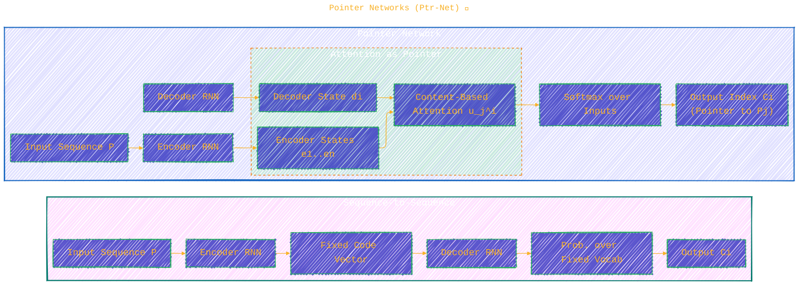
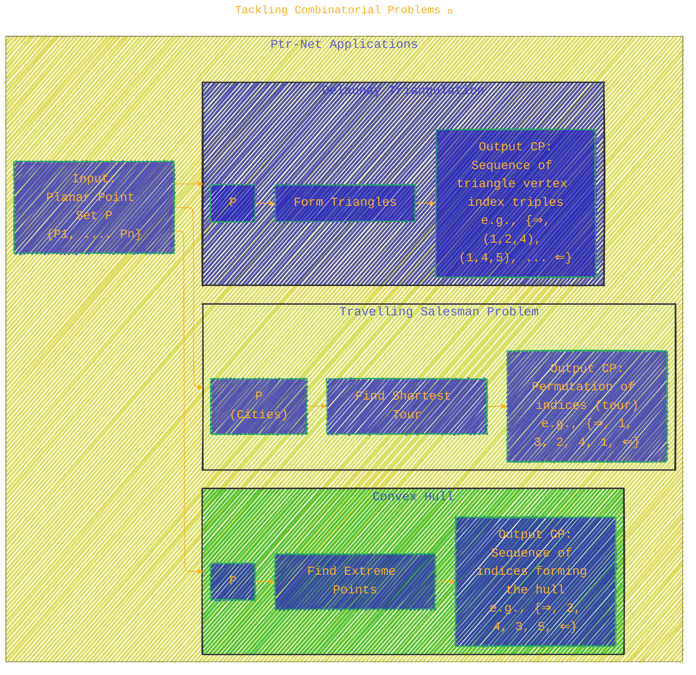

<div align="center">
  <p>⚠️🏗️🚧🦺🧱🪵🪨🪚🛠️👷</p>
  <i>This is a working draft in progress.</i>
  <br/>
  
  <br/>
  <blockquote>
	  <!-- <em>The scene is from the series <b>Mr. Robot</b>
    <br/>
    <a href="https://www.usanetwork.com/mr-robot">Mr. Robot Official Site</a></em>
	  <br/> -->
	  <i>gif image is provided by <a href="https://giphy.com">Giphy</a></i>
    <br/>
  </blockquote>
  <p>⚠️🏗️🚧🦺🧱🪵🪨🪚🛠️👷</p>

</div>


# Pointer Networks
<details open>
<summary>Click to show/hide the full disclaimer.</summary>
   
> <ins>📢 **Disclaimer** 🚨</ins>
>
> This document contains my personal notes on the topic,
> compiled from publicly available documentation and various cited sources.
> The materials are intended for 👨‍🎓 <ins>educational purposes</ins> 👨‍🎓 (<ins>:trollface:sometimes, entertainment purposes:trollface:</ins>), 📖 <ins> personal study </ins> 📖, and 🔖 <ins> reference </ins> 🔖.
> The content is dual-licensed:
> 1. **MIT License:** Applies to all code implementations (Swift, Mermaid, and other programming languages).
> 2. **Creative Commons Attribution-ShareAlike 4.0 International License (CC BY-SA 4.0):** Applies to all non-code content, including text, explanations, diagrams, and illustrations.

</details>


----

## Pointer Networks: Unveiling the Magic 🪄

Pointer Networks (Ptr-Nets), introduced by Vinyals, Fortunato, and Jaitly [1], present a novel neural architecture designed to learn the conditional probability of an output sequence where elements are discrete tokens corresponding to **positions within an input sequence**. This is a game-changer because traditional sequence-to-sequence models [2] or Neural Turing Machines [3] struggle when the number of possible output classes changes with the input's length.

Imagine problems like sorting sequences of varying lengths, or combinatorial optimization tasks such as finding convex hulls, Delaunay triangulations, or solving the Travelling Salesman Problem (TSP). These are exactly the kind of challenges Ptr-Nets are built for! 🎯

The core idea is ingeniously simple yet powerful: Ptr-Nets repurpose the **attention mechanism** [4]. Instead of using attention to blend encoder hidden states into a context vector for the decoder, Ptr-Nets use attention as a **pointer** 👆 to directly select an element from the input sequence as the output at each step.

---

## Key Contributions 🏆

The paper highlights several key achievements:

1.  **Novel Architecture (Ptr-Net):** A simple and effective model that addresses variable-length output dictionaries using a softmax distribution as a "pointer."
2.  **Application to Geometric Problems:** Successfully applied to learn approximate solutions for three challenging geometric tasks:
	*   Planar Convex Hulls
	*   Delaunay Triangulations
	*   Planar Travelling Salesman Problem (TSP)
3.  **Generalization:** The learned models demonstrate an ability to generalize to problems with input sequences longer than those seen during training.
4.  **Competitive TSP Solver:** The Ptr-Net learns a competitive approximate solver for small-scale TSP (n ≤ 50), showcasing the potential of purely data-driven approaches for NP-hard problems.

Let's delve into how Ptr-Nets differ from their predecessors.

----

## Models: From Sequence-to-Sequence to Pointers 🗺️

### 1. Sequence-to-Sequence (Seq2Seq) Model

The foundation: proposed by Sutskever et al. [2].
Given an input sequence $P = \{P_1, \dots, P_n\}$ and an output sequence of indices $C^P = \{C_1, \dots, C_{m(P)}\}$ (where each $C_i$ is an index from $1$ to $n$), the model computes the conditional probability:

$$
p(C^P | P; \theta) = \prod_{i=1}^{m(P)} p_\theta(C_i | C_1, \dots, C_{i-1}, P; \theta)
$$

The parameters $\theta$ are learned by maximizing the log-likelihood over the training set:

$$
\theta^* = \arg \max_{\theta} \sum_{(P,C^P)} \log p(C^P | P; \theta)
$$

Typically, LSTMs [5] are used for both an *encoder* (processing $P$) and a *decoder* (generating $C^P$).

**Limitation for Ptr-Net's target problems:** The output dictionary size for $C_i$ is fixed. This means a separate model is needed for each input length $n$ if outputs are indices from $1$ to $n$.

### 2. Content-Based Input Attention Model

An enhancement by Bahdanau et al. [4]. This model allows the decoder to "attend" to different parts of the input sequence at each output step, rather than relying solely on the final encoder state.

Let $(e_1, \dots, e_n)$ be encoder hidden states and $(d_1, \dots, d_{m(P)})$ be decoder hidden states.
The attention vector $d'_i$ at decoder step $i$ is computed as:

1.  **Alignment Scores ($u_j^i$):**

	$$
    u_j^i = v^T \tanh(W_1 e_j + W_2 d_i), \quad j \in (1, \dots, n)
    $$

2.  **Attention Weights ($a_j^i$):**

	$$
    a_j^i = \text{softmax}(u^i)_j \quad \text{(softmax over all } j \text{ for a fixed } i)
    $$

3.  **Context Vector ($d'_i$):**

	$$
    d'_i = \sum_{j=1}^n a_j^i e_j
    $$

Here, $v, W_1, W_2$ are learnable parameters. The context vector $d'_i$ is then combined with $d_i$ to predict the output and feed the next decoder step.

**Limitation:** While powerful, this still typically predicts from a fixed-size vocabulary.

### 3. Pointer Networks (Ptr-Net) 🌟

This is where the magic happens! Ptr-Nets modify the attention mechanism to directly output a pointer to an input element.

Instead of creating a context vector $d'_i$ and then predicting an output from a fixed vocabulary, the Ptr-Net uses the alignment scores $u_j^i$ directly to form a probability distribution over the *input positions*:

1.  **Alignment Scores / Logits ($u_j^i$):**

	$$
    u_j^i = v^T \tanh(W_1 e_j + W_2 d_i), \quad j \in (1, \dots, n)
    $$

2.  **Output Probabilities (Pointer):**

	$$
    p(C_i | C_1, \dots, C_{i-1}, P) = \text{softmax}(u^i)
    $$

The output $C_i$ is the index of the input element selected by this softmax distribution. The dictionary size is now inherently $n$, the length of the input sequence! 🤯

The following diagram illustrates the conceptual difference:



### Visualizing the Pointer Mechanism 🔍

Let's use PlantUML to sketch the core attention-to-pointer step in more detail for a single output $C_i$:

```plantuml
/'
title: Visualizing the Pointer Mechanism
author: Cong Le
version: 1.0
license(s): MIT, CC BY-SA 4.0
copyright: Copyright (c) 2025 Cong Le. All Rights Reserved.
'/
@startuml
!theme vibrant

package "Pointer Network - Output Step i" {
  object EncoderStates as "Encoder Hidden States\n(e_1, e_2, ..., e_n)"
  object DecoderState_di as "Decoder Hidden State\n(d_i)"

  cloud AttentionComputation as "Compute Attention Logits u^i" {
    /'component "For each e_j:" as CompEj'/
    CompEj : $W_1 e_j$
    DecoderState_di --> CompEj : $W_2 d_i$
    CompEj --> Tanh : $\tanh(W_1 e_j + W_2 d_i)$
    Tanh --> DotProd_v : $v^T \tanh(W_1 e_j + W_2 d_i) = u_j^i$
  }
  EncoderStates -> CompEj
  
  DotProd_v --> Softmax
  Softmax : $p(C_i=j | ...) = \frac{\exp(u_j^i)}{\sum_k \exp(u_k^i)}$
  /'Softmax --> Output_Pointer[Output: Index Ci (points to P_Ci)]'/
  
  note right of DotProd_v : Logits u^i = (u_1^i, ..., u_n^i)\nInput-dependent length!
}

DecoderState_di ..> AttentionComputation : Modulates
EncoderStates ..> AttentionComputation : Provides content
@enduml
```

This shows that for each potential input element $P_j$ (represented by its encoder state $e_j$), a score $u_j^i$ is computed based on $e_j$ and the current decoder state $d_i$. The collection of these scores $u^i = (u_1^i, \dots, u_n^i)$ is then passed through a softmax layer to produce a probability distribution *over the n input positions*.

----

## Tackling Combinatorial Problems 🧩

Ptr-Nets were tested on three challenging geometric problems. The input $P$ is a set of $n$ points $P_j = (x_j, y_j)$ sampled uniformly from $[0, 1] \times [0, 1]$. The output $C^P$ is a sequence of indices.



> [!NOTE]
> `⇒` and `⇐` represent special start/end of sequence tokens.*

### Training Data Specifics

*   **Convex Hull:** Output sequence starts from the point with the lowest index and goes counter-clockwise.
*   **Delaunay Triangulation:** Triangles $C_i$ are ordered by their incenter coordinates (lexicographically), and vertices within a triangle are ordered by increasing index. This ordering helps reduce ambiguity during training.
*   **TSP:** For optimal solutions (small $n$), Held-Karp algorithm ($O(2^n n^2)$) was used. For larger $n$, approximate algorithms were used for training data. Tours start at the first city.

----

## Empirical Results 📊

Ptr-Nets showed impressive performance:

### Convex Hull

*   On inputs of size $n=50$, Ptr-Net achieved **72.6% accuracy** and **99.9% area coverage**, significantly outperforming LSTM (1.9% acc, FAIL area) and LSTM+Attention (38.9% acc, 99.7% area).
*   **Crucially**, a Ptr-Net trained on lengths 5-50 generalized well. For instance, on $n=100$, it achieved 50.3% accuracy, and even on $n=500$ (never seen during training), it got 1.3% accuracy and 99.2% area coverage. Standard LSTMs or LSTMs with attention cannot be tested on $n'$ if trained on $n \neq n'$.

### Delaunay Triangulation

*   For $n=5$: 80.7% accuracy, 93.0% triangle coverage.
*   For $n=10$: 22.6% accuracy, 81.3% triangle coverage.
*   For $n=50$: 0% exact accuracy, but 52.8% triangle coverage.

### Travelling Salesman Problem (TSP)

*   This is NP-hard, so Ptr-Nets (an $O(n^2)$ algorithm due to attention at each step) were tested for their capacity to learn useful heuristics.
*   **Beam search** was constrained to only output valid tours, as unconstrained Ptr-Nets sometimes produced invalid ones for $n > 20$.
*   **Results for $n=5$ to $n=20$ (trained on optimal data):**
	*   Ptr-Net tour lengths were very close to optimal.
	*   Example: For $n=10$, Optimal: 2.87, Ptr-Net: 2.88.
*   **Generalization (trained on optimal for $n=5-20$):**
	*   $n=25$: Ptr-Net 4.30 (vs. A3 approx algorithm 4.24) - Very good!
	*   $n=30$: Ptr-Net 4.72 (vs. A3 approx 4.60) - Good.
	*   $n=40$: Ptr-Net 5.91 (vs. A3 approx 5.23) - Performance degrades.
	*   $n=50$: Ptr-Net 7.66 (vs. A3 approx 5.79) - Breaks down further.
	The paper notes that TSP is of far greater complexity than $O(n \log n)$ (like convex hull), which might explain the more limited generalization range on TSP.
*   Interestingly, when a Ptr-Net was trained on data from a suboptimal algorithm (A1), it **outperformed** the algorithm it was trying to imitate for $n=50$.

---

## Conclusions and Future Work 🤔🚀

Ptr-Nets offer a significant step forward by allowing neural networks to tackle problems with variable-sized output dictionaries that directly reference input elements. They achieve this by elegantly repurposing the attention mechanism as a pointer.

Key Takeaways:
*   Ptr-Nets can learn solutions to complex combinatorial problems.
*   They naturally handle variable input/output sizes.
*   They can generalize to input sizes not seen during training, although the extent varies with problem complexity.
*   They open up a new class of problems for neural network applications without artificial constraints on output vocabularies.

The authors suggest future work could explore applications to other problems like **sorting** and other **combinatorial optimization tasks**. The method's applicability to frameworks like Memory Networks and Neural Turing Machines is also highlighted.

This work indeed encourages a broader exploration of neural learning for discrete problems! 🎉

---

<div align="center">
	
	<br/>
	<em>Use knowledge wisely. gif image is provided by <a href="https://giphy.com">Giphy</a></em>
</div>

----

```mermaid
---
title: "❓...CongLeSolutionX....❓"
author: "Cong Le"
version: "1.0"
license(s): "MIT, CC BY-SA 4.0"
copyright: "Copyright (c) 2025 Cong Le. All Rights Reserved."
config:
  theme: base
---
%%%%%%%% Mermaid version v11.4.1-b.14
%%{
  init: {
    'flowchart': { 'htmlLabels': false },
    'fontFamily': 'Bradley Hand',
    'themeVariables': {
      'primaryColor': '#fc82',
      'primaryTextColor': '#F8B229',
      'primaryBorderColor': '#27AE60',
      'secondaryColor': '#5229',
      'secondaryTextColor': '#6C3483',
      'lineColor': '#F8B229',
      'fontSize': '20px'
    }
  }
}%%
flowchart LR
    My_Meme@{ img: "https://raw.githubusercontent.com/CongLeSolutionX/CongLeSolutionX/refs/heads/main/assets/images/My-meme-and-question-marks-open-book-old-characters-background.png", label: "..👀..🤐..📖..", pos: "b", w: 200, h: 150, constraint: "off" }
   
    Link_to_my_profile{{"<a href='https://github.com/CongLeSolutionX' target='_blank'>Click here if you care about my profile</a>"}}

  Closing_quote@{ shape: braces, label: "..👀..🤫..📚.."}

   Closing_quote ~~~ My_Meme

    My_Meme animatingEdge@--> Link_to_my_profile
  
  animatingEdge@{ animate: true }

```

---
>**Licenses:**
>
>- **MIT License:**  [](LICENSE) - Full text in [LICENSE](LICENSE) file.
>- **Creative Commons Attribution-ShareAlike 4.0 International**: [CC BY-SA 4.0](https://creativecommons.org/licenses/by-sa/4.0/) [](https://creativecommons.org/licenses/by-sa/4.0/) - Legal details in [LICENSE-CC-BY-SA-4.0](THE_PAST/LICENSE-CC-BY-SA-4.0) and at [Creative Commons official site](https://creativecommons.org/licenses/by-sa/4.0/).
>
---

### References 📚

1.  Vinyals, O., Fortunato, M., & Jaitly, N. (2015). Pointer Networks. *Advances in Neural Information Processing Systems (NIPS)*. ([arXiv:1506.03134](https://arxiv.org/abs/1506.03134))
2.  Sutskever, I., Vinyals, O., & Le, Q. V. (2014). Sequence to sequence learning with neural networks. *Advances in Neural Information Processing Systems (NIPS)*. ([Link](https://proceedings.neurips.cc/paper/2014/hash/a14ac55a4f27472c5d894ec1c3c743d2-Abstract.html))
3.  Graves, A., Wayne, G., & Danihelka, I. (2014). Neural turing machines. *arXiv preprint arXiv:1410.5401*. ([Link](https://arxiv.org/abs/1410.5401))
4.  Bahdanau, D., Cho, K., & Bengio, Y. (2014). Neural machine translation by jointly learning to align and translate. *International Conference on Learning Representations (ICLR)*. ([arXiv:1409.0473](https://arxiv.org/abs/1409.0473))
5.  Hochreiter, S., & Schmidhuber, J. (1997). Long short-term memory. *Neural computation*, 9(8), 1735-1780.

-----
