<div align="center">
  <p>⚠️🏗️🚧🦺🧱🪵🪨🪚🛠️👷</p>
  <i>This is a working draft in progress.</i>
  <br/>
  
  <br/>
  <blockquote>
	  <!-- <em>The scene is from the series <b>Mr. Robot</b>
    <br/>
    <a href="https://www.usanetwork.com/mr-robot">Mr. Robot Official Site</a></em>
	  <br/> -->
	  <i>gif image is provided by <a href="https://giphy.com">Giphy</a></i>
    <br/>
  </blockquote>
  <p>⚠️🏗️🚧🦺🧱🪵🪨🪚🛠️👷</p>

</div>


# Scaling Laws for Neural Language Models
<details open>
<summary>Click to show/hide the full disclaimer.</summary>
   
> <ins>📢 **Disclaimer** 🚨</ins>
>
> This document contains my personal notes on the topic,
> compiled from publicly available documentation and various cited sources.
> The materials are intended for 👨‍🎓 <ins>educational purposes</ins> 👨‍🎓 (<ins>:trollface:sometimes, entertainment purposes:trollface:</ins>), 📖 <ins> personal study </ins> 📖, and 🔖 <ins> reference </ins> 🔖.
> The content is dual-licensed:
> 1. **MIT License:** Applies to all code implementations (Swift, Mermaid, and other programming languages).
> 2. **Creative Commons Attribution-ShareAlike 4.0 International License (CC BY-SA 4.0):** Applies to all non-code content, including text, explanations, diagrams, and illustrations.

</details>


----

## 📜 Overview of "Scaling Laws for Neural Language Models"

This paper empirically investigates how language model performance (measured by cross-entropy loss) scales with model size, dataset size, and training compute. The key finding is that these relationships often follow smooth power laws over several orders of magnitude.

```mermaid
---
title: "Overview of The Scaling Laws for Neural Language Models"
author: "Cong Le"
version: "1.0"
license(s): "MIT, CC BY-SA 4.0"
copyright: "Copyright (c) 2025 Cong Le. All Rights Reserved."
config:
  theme: base
---
%%%%%%%% Mermaid version v11.4.1-b.14
%%{
  init: {
    'fontFamily': 'American Typewriter, monospace',
    'logLevel': 'fatal',
    'mindmap': {
	    'nodeAlign': 'center',
	    'padding': 20
    },
    'themeVariables': {
      'primaryColor': '#FC82',
      'primaryTextColor': '#F8B229',
      'primaryBorderColor': '#27AE60',
      'secondaryColor': '#EBF3',
      'secondaryTextColor': '#6C3483',
      'secondaryBorderColor': '#A569BD',
      'fontSize': '20px'
    }
  }
}%%
mindmap
  root)"Scaling Laws for NLMs 🧠"(
    Key_Findings))"Key Findings"((
      Scale_Dominates Performance ✨
        Model_Parameters_N ("Number of non-embedding parameters")
        Dataset_Size_D ("Number of tokens in training data")
        Compute_C ("Total PF-days for training")
      Weak_Model_Shape_Dependence ("Depth, width, heads matter less than N")
      Smooth_Power_Laws 📉
        L_vs_N ("Loss vs. N: L ~ N<sup>-α<sub>N</sub></sup>")
        L_vs_D ("Loss vs. D: L ~ D<sup>-α<sub>D</sub></sup>")
        L_vs_C_min ("Loss vs. C<sub>min</sub>: L ~ C<sub>min</sub><sup>-α<sub>C<sub>min</sub></sub></sup>")
      Universal_Overfitting  overfitting_equation ("Predictable penalty based on N<sup>0.74</sup>/D ratio")
      Universal_Training_Curves ("Predictable power-law training curves")
      Transfer_Improves_with_Test_Perf 🌐 ("Constant loss penalty for different distributions")
      Sample_Efficiency_Large_Models 💡 ("Larger models learn faster from fewer examples")
      Convergence_is_Inefficient 🐢💨
        ("Train very large models, stop significantly before convergence for optimal compute use")
      Optimal_Batch_Size_B_crit ("B<sub>crit</sub> scales with L: B<sub>crit</sub> ~ L<sup>-1/α<sub>B</sub></sup>")
    Core_Variables_Notation))"Core_Variables_Notation"((
      L ("L: Cross-entropy loss (nats)")
      N ("N: Non-embedding parameters")
      D ("D: Dataset size (tokens)")
      S ("S: Training steps (parameter updates)")
      B ("B: Batch size (sequences)")
      C ("C ≈ 6NBS: Training compute (FLOPs, PF-days)")
      C_min ("C<sub>min</sub>: Minimum compute to reach a given L (at B << B<sub>crit</sub>)")
      S_min ("S<sub>min</sub>: Minimum training steps to reach a given L (at B >> B<sub>crit</sub>)")
      B_crit ("B<sub>crit</sub>: Critical batch size for optimal time/compute tradeoff")
      α_X ("α<sub>X</sub>: Power-law exponent for variable X")
      X_c ("X<sub>c</sub>: Constant scale factor for variable X")

    Key_Scaling_Laws_Equations))"Key_Scaling_Laws_Equations"((
      L_N_isolated ("$$ L(N) = (N_c/N)^{\\alpha_N} $$")
      L_D_isolated ("$$ L(D) = (D_c/D)^{\\alpha_D} $$")
      L_Cmin_isolated ("$$ L(C_{min}) = (C_{min_c}/C_{min})^{\\alpha_{C_{min}}} $$")
      L_N_D_combined ("$$ L(N, D) = \\left( \\left(\\frac{N_c}{N}\\right)^{\\alpha_N/\\alpha_D} + \\frac{D_c}{D} \\right)^{\\alpha_D} $$")
      L_N_S_combined ("$$ L(N, S_{min}) = \\left( \\frac{N_c}{N} \\right)^{\\alpha_N} + \\left( \\frac{S_c}{S_{min}} \\right)^{\\alpha_S} $$")
      B_crit_L_relation ("$$ B_{crit}(L) = B^*/L^{1/\\alpha_B} $$")
      Optimal_Allocation_Scaling
        N_opt_vs_C ("N<sub>opt</sub> ~ C<sub>min</sub><sup>α<sub>C<sub>min</sub></sub>/α<sub>N</sub></sup>")
        S_opt_vs_C ("S<sub>min,opt</sub> ~ C<sub>min</sub><sup>α<sub>C<sub>min</sub></sub>/α<sub>S</sub></sup>")
        B_opt_vs_C ("B<sub>opt</sub> ~ C<sub>min</sub><sup>α<sub>C<sub>min</sub></sub>/α<sub>B</sub></sup>")
        D_needed ("D<sub>needed</sub> = B<sub>opt</sub> * S<sub>min,opt</sub> ~ C<sub>min</sub><sup>0.27</sup>")

 
    Implications_Conjectures))"Major Implications & Conjectures"((
      Optimal_Compute_Use 💰
        ("Primarily increase N (model size)")
        ("Moderately increase B (batch size for parallelism)")
        ("Slightly increase S (serial training steps)")
      Contradiction_at_Extremes 💥
        ("L(C<sub>min</sub>) trend eventually predicts loss lower than L(D) implies for the data used")
        Estimate_for_Max_Performance_Limit ("N*, D*, C*, L*")
          ("Could indicate breakdown of laws or fundamental limits of NLM performance / language entropy")

    Methodology_Details))"Methodology_Details"((
      Empirical_Study ("Training numerous Transformer models")
      Architecture ("Decoder-only Transformers")
      Dataset ("WebText2 - large, diverse text corpus")
      Metrics ("Cross-entropy loss on test set and other distributions")

    Citation_Info("[Kaplan et al., 2020](https://arxiv.org/abs/2001.08361)")
```



----

## ⚙️ Transformer Parameterization and Compute (Section 2.1)

The paper defines model size ($N$) based on non-embedding parameters and estimates training compute ($C$).

```dot
/*
 * title: DOT Diagram for Transformer Parameterization & Compute
 * author: Cong Le
 * version: 1.0
 * license(s): MIT, CC BY-SA 4.0
 * copyright: Copyright (c) 2025 Cong Le. All Rights Reserved.
 */
digraph TransformerParams {
    rankdir=LR
    // node [shape=record, style="rounded,filled", fontname="Helvetica", fontsize=10]
    node [style="rounded,filled", fontname="Helvetica", fontsize=10]
    edge [fontname="Helvetica", fontsize=9]
    graph [label="Transformer Parameterization & Compute Estimates", labelloc=t, fontsize=12, fontname="Helvetica"]

    params [label="{Transformer Parameters | {Non-Embedding Parameters (N) | Embeddings (Vocab + Positional)}}", fillcolor=lightblue]
    
    hyperparams [label="{Key Hyperparameters | n_layer (num layers) | d_model (residual stream dim) | d_ff (feed-fwd layer dim) | d_attn (attention output dim) | n_heads (num attention heads)}", fillcolor=beige]

    N_calc_general [label="{Non-Embedding Parameters (N) Formula\n(General) | N ≈ 2 * d_model * n_layer * (2*d_attn + d_ff) | Excludes biases, LayerNorm etc.}", fillcolor=lightyellow]
    N_calc_standard [label="{Non-Embedding Parameters (N) Formula\n(Standard Shape: d_attn = d_model, d_ff = 4*d_model) | N ≈ 12 * n_layer * d_model^2}", fillcolor=lightyellow]
    
    compute_token [label="{Training Compute per Token (C_token) | C_token ≈ 6N FLOPs | Accounts for forward (2N) & backward (4N) passes.\nExcludes context-dependent terms if d_model >> n_ctx/12}", fillcolor=green]
    compute_fwd_token [label="{Forward Pass Compute per Token (C_forward_token) | C_forward_token ≈ 2N + 2*n_layer*n_ctx*d_attn | Params term: 2N | Context Attention term: 2*n_layer*n_ctx*d_attn}", fillcolor=lightcyan]
    
    hyperparams -> N_calc_general [label="determine"]
    N_calc_general -> N_calc_standard [label="simplifies to (for standard shape)"]
    params -> N_calc_general [label="focus for 'Model Size'"]
    N_calc_general -> compute_token [label="basis for"]
    compute_token -> compute_fwd_token [label="derived from (with backward pass factor)"]
    
    total_compute [label="{Total Training Compute (C) | C ≈ 6 * N * B * S | B: batch size (sequences) | S: training steps}", fillcolor=gold]
    compute_token -> total_compute [label="multiplied by B*S gives"]

    {rank=same; hyperparams params}
    {rank=same; N_calc_general N_calc_standard}
    {rank=same; compute_fwd_token compute_token total_compute}
}
```



**Key Equations from Section 2.1:**
-   Number of non-embedding parameters ($N$):
	-   General: $N \approx 2 d_{model} n_{layer} (2d_{attn} + d_{ff})$
	-   Standard ($d_{attn} = d_{model}, d_{ff} = 4d_{model}$): $N \approx 12 n_{layer} d_{model}^2$
-   Forward pass compute per token ($C_{forward}$): $C_{forward} \approx 2N + 2n_{layer}n_{ctx}d_{attn}$
-   Total training compute ($C$): $C \approx 6NBS$ (where B is batch size in sequences, S is training steps)

----

## 📊 Basic Power Laws (Section 3)

Performance scales as a power law with model size ($N$), dataset size ($D$), and minimum compute ($C_{min}$) when each is the limiting factor.

```dot
/*
 * title: DOT Diagram for Basic Power Laws
 * author: Cong Le
 * version: 1.0
 * license(s): MIT, CC BY-SA 4.0
 * copyright: Copyright (c) 2025 Cong Le. All Rights Reserved.
 */
digraph BasicPowerLaws {
    graph [label="Key Scaling Laws for Language Model Loss (L)\n(When not bottlenecked by other factors)", labelloc=t, fontsize=14, fontname="Helvetica"]
    node [shape=box, style="rounded,filled", fontname="Helvetica", fontsize=10]
    edge [arrowhead=vee, fontname="Helvetica", fontsize=9]

    subgraph cluster_LN {
        label="Loss vs. Model Parameters (N)"
        labelloc=t
        style=filled
        fillcolor=azure
        LN [label="L(N) ≈ (N_c/N)^α_N\nα_N ≈ 0.076", shape=parallelogram, fillcolor=white];
        N_node [label="N\n(Non-embedding model parameters)", shape=ellipse, style=filled, fillcolor=lightblue]
        L_node1 [label="L\n(Cross-Entropy Loss)", shape=ellipse, style=filled, fillcolor=lightcoral]
        N_node -> LN [label="scales"]
        LN -> L_node1 [label="predicts"]
        LN_desc [label="Performance improves as N increases.\n(Trained to convergence on large dataset)", shape=note, fillcolor=ivory]
        LN -> LN_desc [style=dotted, arrowhead=none]
    }

    subgraph cluster_LD {
        label="Loss vs. Dataset Size (D)"
        labelloc=t
        style=filled
        fillcolor=lightgoldenrodyellow
        LD [label="L(D) ≈ (D_c/D)^α_D\nα_D ≈ 0.095", shape=parallelogram, fillcolor=white]
        D_node [label="D\n(Dataset size in tokens)", shape=ellipse, style=filled,fillcolor=green]
        L_node2 [label="L\n(Cross-Entropy Loss)", shape=ellipse, style=filled, fillcolor=lightcoral]
        D_node -> LD [label="scales"]
        LD -> L_node2 [label="predicts"]
        LD_desc [label="Performance improves as D increases.\n(Large models, training with early stopping)", shape=note, fillcolor=ivory]
        LD -> LD_desc [style=dotted, arrowhead=none]
    }

    subgraph cluster_LCmin {
        label="Loss vs. Minimum Compute (C_min)"
        labelloc=t
        style=filled
        fillcolor=lavender
        LCmin [label="L(C_min) ≈ (C_min_c/C_min)^α_Cmin\nα_Cmin ≈ 0.050", shape=parallelogram, fillcolor=white]
        Cmin_node [label="C_min\n(Optimally allocated compute, PF-days)", shape=ellipse, style=filled, fillcolor=lightyellow]
        L_node3 [label="L\n(Cross-Entropy Loss)", shape=ellipse, style=filled, fillcolor=lightcoral]
        Cmin_node -> LCmin [label="scales"]
        LCmin -> L_node3 [label="predicts"]
        LCmin_desc [label="Performance improves as C_min increases.\n(Optimal N, B << B_crit, sufficient D)", shape=note, fillcolor=ivory]
        LCmin -> LCmin_desc [style=dotted, arrowhead=none]
    }
    
    Overall_Note [label="These laws hold over many orders of magnitude. Constants N_c, D_c, C_min_c depend on tokenization/vocab.", shape=plaintext, fontsize=10]
}
```



**Equations:**
1.  **Loss vs. Non-embedding Parameters ($N$):** (Eq. 1.1)

	$$ L(N) = \left(\frac{N_c}{N}\right)^{\alpha_N} \quad (\alpha_N \approx 0.076) $$

2.  **Loss vs. Dataset Size ($D$):** (Eq. 1.2)

	$$ L(D) = \left(\frac{D_c}{D}\right)^{\alpha_D} \quad (\alpha_D \approx 0.095) $$

3.  **Loss vs. Minimum Compute ($C_{min}$):** (Eq. 1.3)

	$$ L(C_{min}) = \left(\frac{C_{min_c}}{C_{min}}\right)^{\alpha_{C_{min}}} \quad (\alpha_{C_{min}} \approx 0.050) $$

### 🧪 Model Shape Independence & Generalization

-   **Shape Independence:** Performance depends weakly on $n_{layer}, n_{heads}, d_{ff}$ if $N$ is fixed (Section 3.1).
-   **Generalization:** Transfer to different text distributions incurs a constant penalty in loss but otherwise improves in line with training set performance (Section 3.2.2).

### 🆚 LSTMs vs. Transformers Comparison (Section 3.2.1)

```mermaid
---
title: "CHANGE_ME_DADDY"
author: "Cong Le"
version: "1.0"
license(s): "MIT, CC BY-SA 4.0"
copyright: "Copyright (c) 2025 Cong Le. All Rights Reserved."
config:
  layout: elk
  theme: base
  look: handDrawn
---
%%%%%%%% Mermaid version v11.4.1-b.14
%%%%%%%% Available curve styles include the following keywords:
%% basis, bumpX, bumpY, cardinal, catmullRom, linear, monotoneX, monotoneY, natural, step, stepAfter, stepBefore.
%%{
  init: {
    'flowchart': { 'htmlLabels': true, 'curve': 'basis' },
    'fontFamily': 'American Typewriter, monospace',
    'logLevel': 'fatal',
    'themeVariables': {
      'primaryColor': '#22BB',
      'primaryTextColor': '#F8B229',
      'lineColor': '#F8B229',
      'primaryBorderColor': '#27AE60',
      'secondaryColor': '#E2F1',
      'secondaryTextColor': '#6C3483',
      'secondaryBorderColor': '#A569BD',
      'fontSize': '20px'
    }
  }
}%%
flowchart LR
    subgraph "LSTM vs. Transformer Performance Comparison 🥊"
        A["Model Parameters (N, non-embedding)"] --> B_LSTM["LSTM Performance"];
        A --> C_Transformer["Transformer Performance"];

        B_LSTM --> D["Performance plateaus for tokens later in context 📉"];
        D --> D_math["$$L_{LSTM}(\text{token}_i) \text{ saturates for large } i$$ <br> (Limited by sequential processing of context)"];
        
        C_Transformer --> E["Continues to improve for tokens throughout long contexts (e.g., 1024 tokens) ✨"];
        E --> E_math["$$L_{Transformer}(\text{token}_i) \text{ improves even for large } i$$ <br> (Benefits from attention mechanism over full context)"];
        
        F["Overall Result 🏆"] --> G["Transformers asymptotically outperform LSTMs, especially due to superior utilization of long-range context information."];
        B_LSTM -.-> F;
        C_Transformer --> F;
    end
    style D_math fill:#fdf, stroke:#333, stroke-width:2px
    style E_math fill:#fdf, stroke:#333, stroke-width:2px
    style G fill:#lightgreen, stroke:#333, stroke-width:2px
```



----

## 🌊 Charting the Infinite Data Limit and Overfitting (Section 4)

This section introduces a combined scaling law $L(N,D)$ that describes performance when both model size $N$ and dataset size $D$ vary, particularly addressing overfitting.

```dot
/*
 * title: DOT Diagram for L(N,D) and Overfitting
 * author: Cong Le
 * version: 1.0
 * license(s): MIT, CC BY-SA 4.0
 * copyright: Copyright (c) 2025 Cong Le. All Rights Reserved.
 */
digraph L_N_D_Overfitting {
    graph [label="Combined Loss Scaling L(N,D) & Overfitting (Eq. 1.5 / 4.1)", labelloc=t, fontsize=14, fontname="Helvetica"]
    // node [shape=record, style="rounded,filled", fontname="Helvetica", fontsize=10]
    node [style="rounded,filled", fontname="Times", fontsize=10]
    edge [fontname="Helvetica", fontsize=9]

    L_N_D_formula [label="{L(N,D) | <f0> \left( \left(\frac{N_c}{N}\right)^{\frac{\alpha_N}{\alpha_D}} + \frac{D_c}{D} \right)^{\alpha_D}}", peripheries=2, fillcolor=lightyellow]
    
    Term_N_contrib [label="{N-Contribution | (N_c/N)^(α_N/α_D) | Represents performance limit due to model capacity (N).\nDominant when D is very large.}", fillcolor=lightblue]
    Term_D_contrib [label="{D-Contribution | D_c/D | Represents performance limit due to data availability (D).\nDominant when N is very large (model overfits).}", fillcolor=green]
    
    L_N_D_formula:f0 -> Term_N_contrib [label="combines"]
    L_N_D_formula:f0 -> Term_D_contrib [label="combines"]
    
    alpha_D_outer [label="{Outer Exponent α_D | α_D ≈ 0.103 (from L(N,D) fit) | Sets the overall scaling with the combined term.}", shape=ellipse, fillcolor=lavender]
    L_N_D_formula:f0 -> alpha_D_outer [label="scaled by"]
    
    Principles [label="{Key Design Principles Guiding L(N,D) Form: | 1. Rescalable with tokenization changes (N_c, D_c). | 2. Limiting behavior: L(N,D) → L(N) as D→∞; L(N,D) → L(D) as N→∞. | 3. Analyticity at D=∞ (allows 1/D expansion for overfitting).}", shape=note, fillcolor=beige]
    
    Overfitting_Metric [label="{Overfitting Metric: δL(N,D) | δL = L(N,D)/L(N,∞) - 1 | Quantifies performance loss due to finite D compared to infinite data.}", fillcolor=lightcoral, style=filled]
    Overfitting_Control [label="{To Control Overfitting (keep δL small): | Dataset D should scale with N as: D ≳ K * N^(α_N/α_D) | Empirically: D ≳ (5 × 10^3) * N^0.74 | (α_N/α_D ≈ 0.076/0.095 ≈ 0.8, paper uses 0.74 based on full L(N,D) fit which differs slightly for α_D value)", shape=note, fillcolor=ivory]
    
    L_N_D_formula -> Principles [style=dashed, label="guided by"]
    L_N_D_formula -> Overfitting_Metric [style=dashed, label="helps quantify"]
    Overfitting_Metric -> Overfitting_Control [style=dashed, label="leads to rule for"]

    {rank=same; Term_N_contrib Term_D_contrib}
    annotation [label="This equation governs simultaneous dependence on N and D, and the degree of overfitting.\nNote: α_N, α_D, N_c, D_c fitted values might differ slightly from isolated fits.", shape=plaintext, fontsize=9]
}
```



**Combined Scaling Law $L(N,D)$:** (Eq. 1.5 / 4.1)

$$ L(N, D) = \left( \left(\frac{N_c}{N}\right)^{\frac{\alpha_N}{\alpha_D}} + \frac{D_c}{D} \right)^{\alpha_D} $$

The paper reports fitted $\alpha_N \approx 0.076$ and $\alpha_D \approx 0.103$ for this combined form (Table 2).
The ratio $\alpha_N/\alpha_D \approx 0.076/0.103 \approx 0.738$.
**Overfitting Control:** To keep overfitting minimal, dataset size $D$ should scale sub-linearly with model size $N$:

$$ D \gtrsim (5 \times 10^3) N^{0.74} $$

----

## ⏱️ Scaling Laws with Model Size and Training Time (Section 5)

This section explores how loss $L$ depends on model size $N$ and training steps $S$, after adjusting for batch size effects using the critical batch size $B_{crit}$.

### Critical Batch Size $B_{crit}$ and Training Adjustments (Section 5.1)

```mermaid
---
title: "Critical Batch Size $B_{crit}$ and Training Adjustments (Section 5.1)"
author: "Cong Le"
version: "1.0"
license(s): "MIT, CC BY-SA 4.0"
copyright: "Copyright (c) 2025 Cong Le. All Rights Reserved."
config:
  layout: elk
  theme: base
  look: handDrawn
---
%%%%%%%% Mermaid version v11.4.1-b.14
%%%%%%%% Available curve styles include the following keywords:
%% basis, bumpX, bumpY, cardinal, catmullRom, linear, monotoneX, monotoneY, natural, step, stepAfter, stepBefore.
%%{
  init: {
    'flowchart': { 'htmlLabels': true, 'curve': 'basis' },
    'fontFamily': 'American Typewriter, monospace',
    'logLevel': 'fatal',
    'themeVariables': {
      'primaryColor': '#22BB',
      'primaryTextColor': '#F8B229',
      'lineColor': '#F8B229',
      'primaryBorderColor': '#27AE60',
      'secondaryColor': '#E2F1',
      'secondaryTextColor': '#6C3483',
      'secondaryBorderColor': '#A569BD',
      'fontSize': '20px'
    }
  }
}%%
flowchart TD
    subgraph Critical_Batch_Size_and_Training_Step_Compute_Adjustments["Critical Batch Size & Training Step/Compute Adjustments 🛠️"]
        A["Achieved Loss<br/>(L)"] --"Determines<br/> (MKAT18)"--> B["Critical Batch Size:<br/> B_crit(L)"]
        B --> B_formula["$$ B_{crit}(L) \\approx \\frac{B^*}{L^{1/\\alpha_B}} $$ <br> B* ≈ 2 × 10<sup>8</sup> tokens, α<sub>B</sub> ≈ 0.21 <br> Independent of N, depends only on current L."]
        B_formula --> B_note["B_crit(L) is the batch size for optimal time/compute tradeoff."]
        
        C["S:<br/>Actual training steps <br>@ Batch B, Loss L"] --> D["S_min:<br/>Minimum Equivalent Steps"]
        D --> D_formula["$$ S_{min}(S, L, B) = \\frac{S}{1 + B_{crit}(L)/B} $$ <br> (Normalized as if trained at B >> B_crit)"]
        
        E["C:<br/>Actual compute <br>@ Batch B, Loss L"] --> F["C_min: Minimum Equivalent Compute"]
        F --> F_formula["$$ C_{min}(C, L, B) = \\frac{C}{1 + B/B_{crit}(L)} $$ <br> (Normalized as if trained at B << B_crit)"]
        
        G["Underlying Training Efficiency<br/>(McCandlish et al. 2018)"]
        G --> G_formula["$$ \\left( \\frac{S}{S_{min,L}} - 1 \\right) \\left( \\frac{E}{E_{min,L}} - 1 \\right) = 1 $$ <br> E = BS (total examples processed to reach L) <br> S<sub>min,L</sub>, E<sub>min,L</sub> are min steps/examples for loss L.<br> B_crit(L) = E<sub>min,L</sub> / S<sub>min,L</sub> "]
        
        B --"Defines optimal point for"--> G
        D --"Used in"--> H["L(N, S_min) analysis"]
        F --"Used in"--> I["L(C_min) analysis for optimal allocation"]
    end
    style B_formula fill:#f9f3, stroke:#333, stroke-width:2px
    style D_formula fill:#f9f3, stroke:#333, stroke-width:2px
    style F_formula fill:#f9f3, stroke:#333, stroke-width:2px
    style G_formula fill:#f9f3, stroke:#333, stroke-width:2px
    style B_note fill:#eee2, stroke:#333, stroke-width:1px
```



**Key Equations from Section 5.1:**
-   **Critical Batch Size $B_{crit}(L)$:** (Eq. 1.4 / 5.3)

	$$ B_{crit}(L) \approx \frac{B^*}{L^{1/\alpha_B}} \quad (B^* \approx 2 \times 10^8 \text{ tokens, } \alpha_B \approx 0.21) $$

-   **Minimum training steps $S_{min}$ (adjusted from actual steps $S$ at batch $B$):** (Eq. 5.4)

	$$ S_{min}(S) = \frac{S}{1 + B_{crit}(L)/B} $$

-   **Minimum compute $C_{min}$ (adjusted from actual compute $C$ at batch $B$):** (Eq. 5.5)

	$$ C_{min}(C) = \frac{C}{1 + B/B_{crit}(L)} $$

### Loss $L(N, S_{min})$ (Section 5.2)

```dot
/*
 * title: DOT Diagram for L(N, S_min)
 * author: Cong Le
 * version: 1.0
 * license(s): MIT, CC BY-SA 4.0
 * copyright: Copyright (c) 2025 Cong Le. All Rights Reserved.
 */
digraph L_N_Smin {
    graph [label="Loss vs. Model Size (N) and Min Training Steps (S_min) - Eq 1.6 / 5.6", labelloc=t, fontsize=14, fontname="Helvetica"]
    // node [shape=record, style="rounded,filled", fontname="Arial", fontsize=10]
    node [style="rounded,filled", fontname="Arial", fontsize=10]
    edge [fontname="Helvetica", fontsize=9]

    L_N_S_formula [label="{L(N, S_{min}) | <f0> \left( \frac{N_c}{N} \right)^{\alpha_N} + \left( \frac{S_c}{S_{min}} \right)^{\alpha_S} }", peripheries=2, fillcolor=lightyellow]
    
    Term_N_contrib [label="{N-Contribution | (N_c/N)^α_N | Loss component due to finite model capacity (N).\nα_N ≈ 0.077 (for this fit)}", fillcolor=lightblue]
    Term_S_contrib [label="{S_min-Contribution | (S_c/S_min)^α_S | Loss component due to finite training steps (S_min).\nα_S ≈ 0.76 (for this fit)}", fillcolor=green]
    
    S_min_def [label="{S_{min} | Effective minimum training steps (parameter updates), adjusted for optimal batching using B_crit(L).}", shape=ellipse, fillcolor=beige]
    
    L_N_S_formula:f0 -> Term_N_contrib [label="is sum of"]
    L_N_S_formula:f0 -> Term_S_contrib [label="is sum of"]
    
    Term_S_contrib -> S_min_def [label="depends on"]

    Fit_Params [label="{Fitted Parameters (Table 3):\n α_N ≈ 0.077\n α_S ≈ 0.76\n N_c ≈ 6.5 × 10^13 params\n S_c ≈ 2.1 × 10^3 steps}", shape=note, fillcolor=ivory];
    L_N_S_formula -> Fit_Params [style=dashed, label="uses"]
    
    Implications [label="{Important Implications: | - Describes learning curves after initial warmup/transient. \n - Universality (approx. independence of N for α_S, S_c) suggests Hessian eigenvalue density is roughly independent of model size. \n - Forms the basis for deriving optimal compute allocation strategy.}", shape=note, fillcolor=lavender];
    L_N_S_formula -> Implications [style=dashed, label="leads to"]   

    Annotation [label="Note: This is an additive form. The loss is the sum of a term from model size and a term from training steps.\n This differs from the multiplicative structure (before outer exponent) of L(N,D).", shape=plaintext, fontsize=9]
}
```



**Combined Scaling Law $L(N,S_{min})$:** (Eq. 1.6 / 5.6)

$$ L(N, S_{min}) = \left( \frac{N_c}{N} \right)^{\alpha_N} + \left( \frac{S_c}{S_{min}} \right)^{\alpha_S} $$

Fitted parameters (Table 3): $\alpha_N \approx 0.077$, $\alpha_S \approx 0.76$, $N_c \approx 6.5 \times 10^{13}$, $S_c \approx 2.1 \times 10^3$.

----

## 🎯 Optimal Allocation of Compute Budget (Section 6 & Appendix B)

Given a fixed compute budget $C_{min}$, this section details how to optimally allocate it between model size $N$, batch size $B$, and training steps $S$ to achieve the minimum loss.


**Optimal Allocation exponents from paper (Eq 1.7 & surrounding text):**
-   $N_{opt} \propto C_{min}^{\approx 0.73}$
-   $B_{opt} \propto C_{min}^{\approx 0.24}$
-   $S_{min,opt} \propto C_{min}^{\approx 0.03}$
-   $D = B \cdot S \propto C_{min}^{\approx 0.27}$ (Dataset size for 1 epoch of training if $D = B_{opt}S_{min,opt}$)

### 💥 Contradiction and Conjecture at Extreme Scales (Section 6.3)

At very large scales, the predicted compute-efficient loss $L(C_{min})$ decreases faster than what would be possible given the amount of data $D(C_{min})$ used in that compute-efficient training, leading to a contradiction.

```dot
/*
 * title: DOT Diagram for Contradiction and Conjecture
 * author: Cong Le
 * version: 1.0
 * license(s): MIT, CC BY-SA 4.0
 * copyright: Copyright (c) 2025 Cong Le. All Rights Reserved.
 */
digraph ContradictionConjecture {
    graph [label="Contradiction & Conjecture at Extreme Scales (Section 6.3)", labelloc=t, fontsize=14, fontname="Helvetica"];
    node [shape=box, style="rounded,filled", fontname="Helvetica", fontsize=10];
    edge [fontname="Helvetica", fontsize=9];

    C_min_large [label="Very Large Compute Budget (C_min)\n(Hypothetical, beyond current experiments)", fillcolor=beige];
    
    Path_ComputeEfficient [label="Path 1: Compute-Efficient Training Scaling"];
    Loss_Cmin [label="Predicted Loss L(C_min) ∝ C_min^{-0.050}\n(Continues steep decrease 📉)", style=filled, fillcolor=lightgreen];
    Data_Used_Cmin [label="Data processed D(C_min) in 1 epoch ∝ C_min^{0.26}\n(Relatively slow growth for compute-efficient training 🐢)", style=filled, fillcolor=lightyellow];

    Path_DataBottleneck [label="Path 2: Implied Data-Bottlenecked Performance"];
    Loss_D_limit [label="Minimum Loss possible with D(C_min) is L(D(C_min)) ∝ D(C_min)^{-0.095}\nThis implies Loss ∝ (C_min^{0.26})^{-0.095} ∝ C_min^{-0.0247} (Shallower decrease 📉🐢)", style=filled, fillcolor=lightcoral];
    
    C_min_large -> Path_ComputeEfficient;
    Path_ComputeEfficient -> Loss_Cmin;
    Path_ComputeEfficient -> Data_Used_Cmin;
    
    Data_Used_Cmin -> Path_DataBottleneck [label="bounds the best achievable loss using"];
    Path_DataBottleneck -> Loss_D_limit;
    
    Contradiction [label="The Contradiction! 🚨\nAt some C*, L(C_min) from Path 1 becomes < L(D(C_min)) from Path 2.\nThis means compute-efficient training would predict a loss lower than theoretically possible with the amount of data it uses!", shape=house, fillcolor=tomato, orientation=270];
    
    Loss_Cmin -> Contradiction [label="predicts"];
    Loss_D_limit -> Contradiction [label="interacts with, creating bound"];
    
    Intersection_Point [label="{Intersection Point (C*, N*, D*, L*) | Where L(C_min) trend meets L(D(C_min)) trend.\nApproximate values (highly uncertain):\nC* ~ 10^4 PF-Days\nN* ~ 10^12 parameters\nD* ~ 10^12 tokens\nL* ~ 1.7 nats/token}", shape=parallelogram, fillcolor=lightblue];
    Contradiction -> Intersection_Point [label="occurs around an estimated"];
    
    Conjecture_Meaning [label="{Conjecture about Intersection Point's Meaning 💡 | This point (or before) might signify: \n1. Breakdown of the current power-law scaling relations. \n2. Approach towards maximal performance of Transformer language models. \n3. The limit of 'reliable information' extractable from natural language data. \n4. L* could offer a rough estimate for the irreducible entropy-per-token of natural language (if trends persist until this point).}", shape=note, fillcolor=gold, width=6];
    Intersection_Point -> Conjecture_Meaning [label="prompts"];

    {rank=same; Loss_Cmin Loss_D_limit Data_Used_Cmin}
}
```



The contradiction arises because $L(C_{min}) \propto C_{min}^{-0.050}$ decreases more rapidly than $L(D(C_{min})) \propto (C_{min}^{0.26})^{-0.095} \approx C_{min}^{-0.025}$.

----

## 🌍 Context Dependence (Appendix D.5)

The paper also explores how loss depends on the token's position within the context.

```dot
/*
 * title: DOT Diagram for Context Dependence
 * author: Cong Le
 * version: 1.0
 * license(s): MIT, CC BY-SA 4.0
 * copyright: Copyright (c) 2025 Cong Le. All Rights Reserved.
 */
digraph ContextDependence {
    graph [label="Loss Dependence on Token Position (T) in Context & Training Context (n_ctx)", labelloc=t, fontsize=14, fontname="Helvetica"];
    node [shape=box, style="rounded,filled", fontname="Helvetica", fontsize=10];
    edge [fontname="Helvetica", fontsize=9];

    subgraph cluster_model_size_effect {
        label="Effect of Model Size (N) at Fixed Training Context (e.g., n_ctx=1024)";
        style=filled; fillcolor=azure;
        
        N_large [label="Larger Model (N_large)", fillcolor=lightcyan];
        N_small [label="Smaller Model (N_small)", fillcolor=lightpink];
        
        Token_Position_T [label="Token Position T in Context (1 to n_ctx)", shape=ellipse, fillcolor=white];

        Loss_T_largeN [label="Loss(T) for N_large:\n- Better overall performance.\n- Steeper improvement slope (L decreases faster as T increases).\n- Better performance even on early tokens (T small).", shape=note, fillcolor=ivory];
        Loss_T_smallN [label="Loss(T) for N_small:\n- Worse overall performance.\n- Shallower improvement slope.", shape=note, fillcolor=ivory];

        N_large -> Token_Position_T [label="evaluates over"];
        N_small -> Token_Position_T [label="evaluates over"];
        Token_Position_T -> Loss_T_largeN [label="results in for N_large"];
        Token_Position_T -> Loss_T_smallN [label="results in for N_small"];
        
        General_N_Trend [label="Pattern: Per-token loss L(T) often scales as a power-law in T: L(T) ≈ A + B * T^-γ.\nLarger N models tend to show larger γ (more efficient at pattern detection with less context).", shape=note, fillcolor=beige];
    }

    subgraph cluster_nctx_effect {
        label = "Effect of Training Context Length (n_ctx)";
        style=filled; fillcolor=lightgoldenrodyellow;

        nctx_long_train [label="Model Trained on Long Context (e.g., n_ctx=1024)", fillcolor=lightgreen];
        nctx_short_train [label="Model Trained on Short Context (e.g., n_ctx=8)", fillcolor=lightyellow];
        
        Early_Tokens [label="Performance on Early Tokens (small T)", shape=ellipse, fillcolor=white];

        Perf_Long_nctx [label="For n_ctx_long_train:\n- Capacity is spread across many context positions.\n- May be suboptimal for very early tokens if model isn't large enough.", shape=note, fillcolor=ivory];
        Perf_Short_nctx [label="For n_ctx_short_train:\n- Capacity is focused on few context positions.\n- Can dominate long-context models on *very* early tokens.", shape=note, fillcolor=ivory];
        
        nctx_long_train -> Early_Tokens [label="performance on"];
        nctx_short_train -> Early_Tokens [label="performance on"];
        Early_Tokens -> Perf_Long_nctx [label="for long train"];
        Early_Tokens -> Perf_Short_nctx [label="for short train"];

        Implication_ctx [label="Implication: To achieve optimal performance across all token positions (early and late), very large models trained on large contexts are likely necessary.", shape=note, fillcolor=beige];
    }
    
    Training_Dynamics_Note [label="Training Dynamics for a Fixed Model (Temporal Aspect):\n1. Learns short-range information first (early tokens' loss improves initially).\n2. Learns longer-range correlations later in training (later tokens' loss improves with more steps).", shape=note, fillcolor=lavender];
}
```



----

## 📚 Summary of Key Equations (Appendix A & Main Text)

This table summarizes the main scaling laws and their parameters.

| Equation For                       | Formula                                                                                            | Key Parameters (Empirical, approx.)                                     | Notes                                                                       |
| :--------------------------------- | :------------------------------------------------------------------------------------------------- | :---------------------------------------------------------------------- | :-------------------------------------------------------------------------- |
| $L(N)$                             | $(N_c/N)^{\alpha_N}$                                                                               | $\alpha_N \approx 0.076$, $N_c \approx 8.8 \times 10^{13}$              | Loss vs. Model Size (non-embed params)                                      |
| $L(D)$                             | $(D_c/D)^{\alpha_D}$                                                                               | $\alpha_D \approx 0.095$, $D_c \approx 5.4 \times 10^{13}$              | Loss vs. Dataset Size (tokens), with early stopping                         |
| $L(C)$ (empirical)                 | $(C_c/C)^{\alpha_C}$                                                                               | $\alpha_C \approx 0.057$, $C_c \approx 1.6 \times 10^{7}$               | Loss vs. Training Compute (fixed batch size, not optimal)                   |
| $L(C_{min})$                       | $(C_{min_c}/C_{min})^{\alpha_{C_{min}}}$                                                           | $\alpha_{C_{min}} \approx 0.050$, $C_{min_c} \approx 3.1 \times 10^{8}$ | Loss vs. Min Compute (optimal N, B $\ll B_{crit}$)                          |
| $B_{crit}(L)$                      | $B^*/L^{1/\alpha_B}$                                                                               | $\alpha_B \approx 0.21$, $B^* \approx 2.1 \times 10^{8}$                | Critical Batch Size (tokens) vs. Loss                                       |
| $L(N,D)$                           | $\left( \left(\frac{N_c}{N}\right)^{\frac{\alpha_N}{\alpha_D}} + \frac{D_c}{D} \right)^{\alpha_D}$ | $\alpha_N \approx 0.076, \alpha_D \approx 0.103$ (Table 2)              | Combined Loss vs. N and D                                                   |
| $L(N,S_{min})$                     | $\left( \frac{N_c}{N} \right)^{\alpha_N} + \left( \frac{S_c}{S_{min}} \right)^{\alpha_S}$          | $\alpha_N \approx 0.077, \alpha_S \approx 0.76$ (Table 3)               | Combined Loss vs. N and Min Steps                                           |
| **Optimal Scaling with $C_{min}$** |                                                                                                    |                                                                         | For compute-efficient training                                              |
| $N_{opt}$                          | $\propto C_{min}^{\alpha_{C_{min}}/\alpha_N} \approx C_{min}^{0.73}$                               |                                                                         | Optimal Model Size                                                          |
| $B_{opt}$                          | $\propto C_{min}^{\alpha_{C_{min}}/\alpha_B} \approx C_{min}^{0.24}$                               |                                                                         | Optimal Batch Size                                                          |
| $S_{min,opt}$                      | $\propto C_{min}^{\alpha_{C_{min}}/\alpha_S} \approx C_{min}^{0.03}$                               |                                                                         | Optimal Min Steps                                                           |
| $D_{needed}$                       | $= B_{opt} \cdot S_{min,opt} \propto C_{min}^{\approx 0.27}$                                        |                                                                         | Approx. Data needed for 1 epoch at optimal settings                         |
| $\alpha_{C_{min}}$ (theory)        | $1 / (1/\alpha_S + 1/\alpha_B + 1/\alpha_N)$                                                       | $\approx 0.054$                                                         | Theoretical exponent for $L(C_{min})$ from $L(N,S_{min})$ and $B_{crit}(L)$ |

----

## 🙏 Conclusion

The work by Kaplan et al. provides a powerful predictive framework for understanding and forecasting the performance of large language models. The observed power laws suggest that continued scaling of model size, dataset, and compute will lead to further improvements, with larger models being significantly more sample-efficient. The optimal strategy involves training very large models for a relatively modest number of steps. These scaling laws have profound implications for AI research and development.

----


<div align="center">
	
	<br/>
	<em>Use knowledge wisely. gif image is provided by <a href="https://giphy.com">Giphy</a></em>
</div>

----

```mermaid
---
title: "❓...CongLeSolutionX....❓"
author: "Cong Le"
version: "1.0"
license(s): "MIT, CC BY-SA 4.0"
copyright: "Copyright (c) 2025 Cong Le. All Rights Reserved."
config:
  theme: base
---
%%%%%%%% Mermaid version v11.4.1-b.14
%%{
  init: {
    'flowchart': { 'htmlLabels': false },
    'fontFamily': 'Bradley Hand',
    'themeVariables': {
      'primaryColor': '#fc82',
      'primaryTextColor': '#F8B229',
      'primaryBorderColor': '#27AE60',
      'secondaryColor': '#5229',
      'secondaryTextColor': '#6C3483',
      'lineColor': '#F8B229',
      'fontSize': '20px'
    }
  }
}%%
flowchart LR
    My_Meme@{ img: "https://raw.githubusercontent.com/CongLeSolutionX/CongLeSolutionX/refs/heads/main/assets/images/My-meme-and-question-marks-open-book-old-characters-background.png", label: "..👀..🤐..📖..", pos: "b", w: 200, h: 150, constraint: "off" }
   
    Link_to_my_profile{{"<a href='https://github.com/CongLeSolutionX' target='_blank'>Click here if you care about my profile</a>"}}

  Closing_quote@{ shape: braces, label: "..👀..🤫..📚.."}

   Closing_quote ~~~ My_Meme

    My_Meme animatingEdge@--> Link_to_my_profile
  
  animatingEdge@{ animate: true }

```

---
>**Licenses:**
>
>- **MIT License:**  [](LICENSE) - Full text in [LICENSE](LICENSE) file.
>- **Creative Commons Attribution-ShareAlike 4.0 International**: [CC BY-SA 4.0](https://creativecommons.org/licenses/by-sa/4.0/) [](https://creativecommons.org/licenses/by-sa/4.0/) - Legal details in [LICENSE-CC-BY-SA-4.0](THE_PAST/LICENSE-CC-BY-SA-4.0) and at [Creative Commons official site](https://creativecommons.org/licenses/by-sa/4.0/).
>
---

### Citation

Kaplan, J., McCandlish, S., Henighan, T., Brown, T. B., Chess, B., Child, R., Gray, S., Radford, A., Wu, J., & Amodei, D. (2020). Scaling Laws for Neural Language Models. *arXiv preprint arXiv:2001.08361*. [https://arxiv.org/abs/2001.08361](https://arxiv.org/abs/2001.08361)

----
