<div align="center">
  <p>⚠️🏗️🚧🦺🧱🪵🪨🪚🛠️👷</p>
  <i>This is a working draft in progress.</i>
  <br/>
  
  <br/>
  <blockquote>
	  <!-- <em>The scene is from the series <b>Mr. Robot</b>
    <br/>
    <a href="https://www.usanetwork.com/mr-robot">Mr. Robot Official Site</a></em>
	  <br/> -->
	  <i>gif image is provided by <a href="https://giphy.com">Giphy</a></i>
    <br/>
  </blockquote>
  <p>⚠️🏗️🚧🦺🧱🪵🪨🪚🛠️👷</p>

</div>


# CHANGE_ME
<details open>
<summary>Click to show/hide the full disclaimer.</summary>
   
> <ins>📢 **Disclaimer** 🚨</ins>
>
> This document contains my personal notes on the topic,
> compiled from publicly available documentation and various cited sources.
> The materials are intended for educational purposes (<ins>sometimes, entertainment purposes</ins>), personal study, and reference.
> The content is dual-licensed:
> 1. **MIT License:** Applies to all code implementations (Swift, Mermaid, and other programming languages).
> 2. **Creative Commons Attribution-ShareAlike 4.0 International License (CC BY-SA 4.0):** Applies to all non-code content, including text, explanations, diagrams, and illustrations.

</details>


----

This paper introduces the **Variational Lossy Autoencoder (VLAE)**, a generative model that combines Variational Autoencoders (VAEs) with autoregressive models (like PixelCNN/PixelRNN). The key idea 💡 is to gain more control over what information is encoded in the latent space and what is discarded, leading to representations that are "lossy" for irrelevant details but preserve essential global information.

## 📜 Table of Contents

1.  [Introduction & Motivation](#1-introduction--motivation)
2.  [Background: Variational Autoencoders (VAEs)](#2-background-variational-autoencoders-vaes)
	*   [The "VAEs Don't Autoencode" Argument](#the-vaes-dont-autoencode-argument)
3.  [Bits-Back Coding: A Theoretical Lens 👓](#3-bits-back-coding-a-theoretical-lens-)
4.  [The Variational Lossy Autoencoder (VLAE) Architecture 🏗️](#4-the-variational-lossy-autoencoder-vlae-architecture-️)
	*   [Lossy Code via Information Preference](#lossy-code-via-information-preference)
	*   [Learned Prior with Inverse Autoregressive Flow (IAF)](#learned-prior-with-inverse-autoregressive-flow-iaf)
5.  [Key Mathematical Formulations 📐](#5-key-mathematical-formulations-)
6.  [Experiments and Results 📊](#6-experiments-and-results-)
7.  [Conclusion and Future Work 🚀](#7-conclusion-and-future-work-)
8.  [References](#8-references)

---

## 1. Introduction & Motivation

Representation learning aims to find meaningful, typically lower-dimensional, representations of data. VAEs are popular for this, but they don't inherently control *what* information is discarded. The authors argue that for tasks like image generation, we might want to discard local, high-frequency texture details while retaining global structure.

**Problem with Standard VAEs:**
*   Difficulty in controlling the information content of the latent code $z$.
*   The decoder might learn to model all details, making the latent code less "abstract."

**VLAE's Goal:**
*   To learn a latent code $z$ that is explicitly lossy for certain types of information (e.g., local statistics in images).
*   To achieve this by using a powerful autoregressive decoder that can model complex local details, forcing $z$ to capture more global, structural aspects.

---

## 2. Background: Variational Autoencoders (VAEs)

VAEs are generative models that learn a probabilistic mapping from a latent space $Z$ to the data space $X$. They consist of two main parts:

*   **Encoder (Probabilistic):** $q_\phi(\mathbf{z}|\mathbf{x})$ approximates the true posterior $p(\mathbf{z}|\mathbf{x})$. It maps input data $\mathbf{x}$ to a distribution in the latent space (typically Gaussian parameters: mean $\mu_\phi(\mathbf{x})$ and variance $\sigma^2_\phi(\mathbf{x})$).
*   **Decoder (Probabilistic):** $p_\theta(\mathbf{x}|\mathbf{z})$ maps points from the latent space $\mathbf{z}$ back to a distribution in the data space.

The VAE is trained by maximizing the **Evidence Lower Bound (ELBO)** on the log-likelihood of the data:

$$
\log p(\mathbf{X}) \geq \mathcal{L}(\theta, \phi; \mathbf{X}) = \sum_{i=1}^{N} \left( \mathbb{E}_{q_\phi(\mathbf{z}|\mathbf{x}^{(i)})} [\log p_\theta(\mathbf{x}^{(i)}|\mathbf{z})] - D_{KL}(q_\phi(\mathbf{z}|\mathbf{x}^{(i)}) || p(\mathbf{z})) \right)
$$

Where:
*   $\mathbb{E}_{q_\phi(\mathbf{z}|\mathbf{x}^{(i)})} [\log p_\theta(\mathbf{x}^{(i)}|\mathbf{z})]$ is the **reconstruction term**: it encourages the decoder to reconstruct the input $\mathbf{x}^{(i)}$ given a latent sample $\mathbf{z}$ from the approximate posterior.
*   $D_{KL}(q_\phi(\mathbf{z}|\mathbf{x}^{(i)}) || p(\mathbf{z}))$ is the **Kullback-Leibler (KL) divergence**: it acts as a regularizer, pushing the approximate posterior $q_\phi(\mathbf{z}|\mathbf{x}^{(i)})$ to be close to a prior distribution $p(\mathbf{z})$ (often a standard normal distribution $\mathcal{N}(0, I)$).


### The "VAEs Don't Autoencode" Argument

The paper highlights that VAEs, as defined by their objective, are not strictly "autoencoders" in the sense of aiming for perfect reconstruction of the input $\mathbf{x}$. The term "$D_{KL}(q(z|x) || p(z))$" regularizes $z$. If $p(x|z)$ is very flexible (e.g., a powerful autoregressive model), it might achieve good "reconstruction" using only a part of $z$, or even by ignoring $z$ if $p(z)$ is also very flexible and captures information about $\mathbf{x}$ (which is not typical for standard VAE priors, but is relevant for VLAE's IAF prior).

The true objective is to maximize the marginal log-likelihood $\log p(\mathbf{x})$. The variational lower bound $\mathcal{L}(\mathbf{x}; \theta)$ is a proxy for this. When the decoder $p(\mathbf{x}|\mathbf{z})$ is powerful, it can model parts of $\mathbf{x}$ without relying on $\mathbf{z}$, especially if $\mathbf{z}$ is heavily regularized to be close to the prior $p(\mathbf{z})$. This means the VAE might choose to *not* encode certain information into $\mathbf{z}$ if the decoder can regenerate it more "cheaply" or if the prior $p(\mathbf{z})$ influences the generation.

---

## 3. Bits-Back Coding: A Theoretical Lens 👓

The paper provides an information-theoretic perspective using **Bits-Back Coding** (Hinton & van Camp, 1993; Frey & Hinton, 1997). This interpretation frames the VAE objective in terms of data compression.

Imagine a two-part coding scheme to transmit data $\mathbf{x}$:
1.  **First, transmit $\mathbf{z}$:** Sample $\mathbf{z}$ from an *approximate posterior* $q(\mathbf{z}|\mathbf{x})$. The cost is $-\log q(\mathbf{z}|\mathbf{x})$.
2.  **Then, transmit $\mathbf{x}$ given $\mathbf{z}$:** The cost is $-\log p(\mathbf{x}|\mathbf{z})$.
3.  **Bits-Back argument:** If the receiver also knows $p(\mathbf{z})$, they can "get back" $\log p(\mathbf{z})$ bits because $q(\mathbf{z}|\mathbf{x})$ was chosen specifically for $\mathbf{x}$, while $p(\mathbf{z})$ is a general prior.

The expected code length using this scheme is:

$$
\mathcal{C}_{\text{BitsBack}}(\mathbf{x}) = \mathbb{E}_{q(\mathbf{z}|\mathbf{x})} [ -\log q(\mathbf{z}|\mathbf{x}) - \log p(\mathbf{x}|\mathbf{z}) + \log p(\mathbf{z}) ]
$$

Rearranging terms, we get:

$$
\mathcal{C}_{\text{BitsBack}}(\mathbf{x}) = \mathbb{E}_{q(\mathbf{z}|\mathbf{x})} [-\log p(\mathbf{x}|\mathbf{z})] + D_{KL}(q(\mathbf{z}|\mathbf{x}) || p(\mathbf{z}))
$$

This is exactly the negative of the VAE's ELBO (Equation 3 in the paper, ignoring the expectation with respect to data):

$$
-\mathcal{L}(\mathbf{x}; \theta) = \mathcal{C}_{\text{BitsBack}}(\mathbf{x})
$$

So, maximizing the ELBO is equivalent to minimizing this expected code length.

The crucial insight for VLAE is that if $p(\mathbf{x}|\mathbf{z})$ (the decoder) is powerful enough to model certain aspects of $\mathbf{x}$ without needing $\mathbf{z}$ (e.g., local textures), then $\mathbf{z}$ only needs to encode the remaining information (e.g., global structure). This makes $\mathbf{z}$ a *lossy* code for the aspects modeled independently by the decoder.


---

## 4. The Variational Lossy Autoencoder (VLAE) Architecture 🏗️

VLAE modifies the standard VAE in two key ways:
1.  **Autoregressive Decoder:** The decoder $p_\theta(\mathbf{x}|\mathbf{z})$ is an autoregressive model like PixelCNN or PixelRNN. These models define the probability of an image pixel by pixel, conditioned on previous pixels (and $\mathbf{z}$).

	$$
    p_\theta(\mathbf{x}|\mathbf{z}) = \prod_{j=1}^{\text{dims}} p_\theta(x_j | \mathbf{x}_{<j}, \mathbf{z})
    $$

2.  **Learned Prior with Inverse Autoregressive Flow (IAF):** The prior $p(\mathbf{z})$ is made more flexible using IAF. This allows the model to learn a more complex distribution for the latent variables, improving density estimation. IAF can also be used for the approximate posterior $q_\phi(\mathbf{z}|\mathbf{x})$.


*Note: The paper discusses IAF mainly for the prior $p(z)$, but also mentions that an "IAF posterior is the same as IAF prior along the encoder path $f^{-1}(q(z|x))$", meaning $q(z|x)$ is also modeled by transforming a simple noise distribution.*

### Lossy Code via Information Preference

The core idea for the "lossy" aspect comes from how the autoregressive decoder interacts with $\mathbf{z}$:
*   **Autoregressive decoders are powerful:** They can model complex local dependencies in data (e.g., pixel-to-pixel correlations in images) very well.
*   **Small Receptive Field for $\mathbf{z}$:** The authors propose using an autoregressive decoder where the latent code $\mathbf{z}$ has a relatively small "receptive field" on the output or influences the generation globally (e.g., by conditioning all autoregressive steps).
	*   For example, in PixelCNN, $p(\mathbf{x}|\mathbf{z}) = \prod_i p(x_i | \mathbf{x}_{<i}, \mathbf{z})$. If $\mathbf{z}$ conditions the entire PixelCNN, it's encouraged to capture global information.
*   **Information Preference:** Because the autoregressive part can handle local details, the model "prefers" to use $\mathbf{z}$ to encode information that the autoregressive mechanism *cannot* easily model, which is typically global structure or long-range dependencies that are beyond the autoregressive model's own local receptive field.
*   **Result:** $\mathbf{z}$ becomes a lossy representation of $\mathbf{x}$, discarding local statistics (handled by the decoder) and retaining global information.

As stated in the paper (Section 3.1):

> *"For instance, if we are interested in learning a global representation for 2D images that doesn't encode information about detailed texture, we can construct a specific factorization of the autoregressive distribution $p(\mathbf{x}|\mathbf{z})$ such that it has a small local receptive field as decoding distribution, e.g., $P_{\text{PixelCNN}}(\mathbf{x}|\mathbf{z})$. Notice, treating $\mathbf{z}$ as an $X_{\text{indexDependOnZ}}$ that is smaller than $\mathbf{x}$, $P_{\text{PixelCNN}}(\mathbf{x}|\mathbf{z}) = \prod p(x_i | \mathbf{x}_{<i}, \mathbf{z})$ won't be able to represent arbitrarily complex distribution over $\mathbf{x}$ without dependence on $\mathbf{z}$ since the receptive field is limited such that not all distributions over $\mathbf{x}$ admit such factorization."*

Effectively, the model learns to compress $\mathbf{x}$ by:
1.  Encoding global information into $\mathbf{z}$.
2.  The autoregressive decoder $p(\mathbf{x}|\mathbf{z})$ then fills in the local details, conditioned on the global guidance from $\mathbf{z}$.

### Learned Prior with Inverse Autoregressive Flow (IAF)

Standard VAEs often use a simple prior like $\mathcal{N}(0, I)$. This can be too restrictive. **Inverse Autoregressive Flow (IAF)** (Kingma et al., 2016) provides a way to transform a simple latent variable distribution (e.g., Gaussian noise $\boldsymbol{\epsilon}$) into a much more complex distribution for $\mathbf{z}$.

An IAF is defined by an invertible transformation $\mathbf{z} = f(\boldsymbol{\epsilon})$ where $\boldsymbol{\epsilon}$ is sampled from a simple base distribution (e.g., $u(\boldsymbol{\epsilon}) = \mathcal{N}(0,I)$). The density of $\mathbf{z}$ can be computed using the change of variables formula:

$$
\log p(\mathbf{z}) = \log u(\boldsymbol{\epsilon}) - \log \left| \det \left( \frac{\partial \mathbf{z}}{\partial \boldsymbol{\epsilon}} \right) \right|
$$

The transformation $f$ is typically an autoregressive neural network, and its Jacobian determinant $\det(\frac{\partial \mathbf{z}}{\partial \boldsymbol{\epsilon}})$ is easy to compute (it's triangular).

By using IAF for the prior $p(\mathbf{z})$ (and for the approximate posterior $q(\mathbf{z}|\mathbf{x})$), VLAE can:
*   Learn a richer, more expressive prior distribution, better matching the true aggregate posterior of the data.
*   Improve density estimation performance, as the KL divergence term in the ELBO will be smaller if $q(\mathbf{z}|\mathbf{x})$ can match a more flexible $p(\mathbf{z})$.
*   The paper mentions (Eq 12-14) how an IAF posterior gives the model more flexibility without increasing computation cost at training time compared to an IAF prior due to the shared structure of the transformation. Specifically, if $z \sim q(z|x)$ is $z = f(\epsilon; x)$ where $\epsilon \sim \mathcal{N}(0,I)$, then the encoding path involves $f^{-1}$. The crucial idea is that an IAF prior allows for a more expressive $p(z)$ that can better match the aggregate $q(z|x)$.

```mermaid
---
title: "Learned Prior with Inverse Autoregressive Flow (IAF)"
author: "Cong Le"
version: "1.0"
license(s): "MIT, CC BY-SA 4.0"
copyright: "Copyright (c) 2025 Cong Le. All Rights Reserved."
config:
  layout: elk
  theme: base
  look: handDrawn
---
%%%%%%%% Mermaid version v11.4.1-b.14
%%%%%%%% Available curve styles include the following keywords:
%% basis, bumpX, bumpY, cardinal, catmullRom, linear, monotoneX, monotoneY, natural, step, stepAfter, stepBefore.
%%{
  init: {
    'flowchart': { 'htmlLabels': true, 'curve': 'basis' },
    'fontFamily': 'American Typewriter, monospace',
    'logLevel': 'fatal',
    'themeVariables': {
      'primaryColor': '#22BB',
      'primaryTextColor': '#F8B229',
      'lineColor': '#F8B229',
      'primaryBorderColor': '#27AE60',
      'secondaryColor': '#E2F1',
      'secondaryTextColor': '#6C3483',
      'secondaryBorderColor': '#A569BD',
      'fontSize': '20px'
    }
  }
}%%
flowchart TD
    subgraph IAF Transformation
        Epsilon["Input Noise ε ~ N(0,I)"] --> AutoregressiveNN["Autoregressive Neural Net (e.g., MADE) <br> z_i = f_i(ε_i; ε_{<i}, h)"]
        AutoregressiveNN --> Z_transformed["Transformed Latent Variable z"]
        AutoregressiveNN --> Jacobian["Jacobian: Product of diagonal elements <br> log |det(dz/dε)| = Σ log |∂z_i/∂ε_i|"]
        LogP_z["log p(z) = log u(ε) - log |det(dz/dε)|"]
        Epsilon --> LogP_z
        Jacobian --> LogP_z
    end

    style Epsilon fill:#ACE1AF,stroke:#333,stroke-width:2px
    style Z_transformed fill:#F4C2C2,stroke:#333,stroke-width:2px
    style AutoregressiveNN fill:#ADD8E6,stroke:#333,stroke-width:2px
```



---

## 5. Key Mathematical Formulations 📐

*   **Variational Lower Bound (ELBO):** (Same as standard VAE)

	$$
    \mathcal{L}(\theta, \phi; \mathbf{x}) = \mathbb{E}_{q_\phi(\mathbf{z}|\mathbf{x})} [\log p_\theta(\mathbf{x}|\mathbf{z})] - D_{KL}(q_\phi(\mathbf{z}|\mathbf{x}) || p(\mathbf{z}))
    $$

	This is equation (2) in the paper, re-arranged from equation (3).

*   **Bits-Back Coding Cost (Negative ELBO):** (Equation 7 re-arranged)

	$$
    \mathcal{C}_{\text{BitsBack}}(\mathbf{x}) = \mathbb{E}_{q(\mathbf{z}|\mathbf{x})} [-\log p(\mathbf{x}|\mathbf{z})] + D_{KL}(q(\mathbf{z}|\mathbf{x}) || p(\mathbf{z}))
    $$

*   **IAF Posterior (Conceptual, based on Eq 12-14):**
	Let $\mathbf{z} = f(\boldsymbol{\epsilon})$ where $\boldsymbol{\epsilon} \sim u(\boldsymbol{\epsilon})$ (e.g., standard Normal). If $f$ is an IAF parameterized by $\mathbf{x}$ (via an encoder), then for an observation $\mathbf{x}$, the latent variable $\mathbf{z}$ is generated as $\mathbf{z} = f(\boldsymbol{\epsilon} ; \text{params}(\mathbf{x}))$. The log probability of sampling $\mathbf{z}$ from $q(\mathbf{z}|\mathbf{x})$ is:

	$$
    \log q(\mathbf{z}|\mathbf{x}) = \log u(\boldsymbol{\epsilon}) - \log \left| \det \left( \frac{\partial \mathbf{z}}{\partial \boldsymbol{\epsilon}} \right) \right|
    $$

	The paper specifies this in terms of $f^{-1}$ for the encoder path: If $\boldsymbol{\epsilon} = f^{-1}(\mathbf{z})$, then for an IAF posterior:

	$$
    \mathcal{L}(\mathbf{x};\theta) = \mathbb{E}_{\mathbf{z} \sim q(\mathbf{z}|\mathbf{x}), \boldsymbol{\epsilon}=f^{-1}(\mathbf{z})} \left[ \log p(\mathbf{x}|\mathbf{f}(\boldsymbol{\epsilon})) + \log u(\boldsymbol{\epsilon}) - \log p(\mathbf{f}(\boldsymbol{\epsilon})) + \log \det \left| \frac{d\mathbf{z}}{d\boldsymbol{\epsilon}} \right| - \log q(\mathbf{z}|\mathbf{x}) \right]
    $$

	This simplifies to (from Eq 14, where $f$ now denotes the prior's IAF mapping and $q(z|x)$ is also an IAF):

	$$
    \mathcal{L}(\mathbf{x};\theta) = \mathbb{E}_{\mathbf{z} \sim q(\mathbf{z}|\mathbf{x}), \boldsymbol{\epsilon}=f^{-1}(\mathbf{z})} \left[ \log p(\mathbf{x}|f(\boldsymbol{\epsilon})) + \log u(\boldsymbol{\epsilon}) - (\log q(\mathbf{z}|\mathbf{x}) - \log \det \left| \frac{d\mathbf{z}}{d\boldsymbol{\epsilon}} \right|) \right]
    $$

---

## 6. Experiments and Results 📊

The paper evaluates VLAE on several tasks and datasets:

*   **Datasets:** Statically Binarized MNIST, OMNIGLOT, Caltech-101 Silhouettes, CIFAR-10.
*   **Tasks:**
	*   **Lossy Compression Visualization:** Shows VLAE can discard local statistics (e.g., pixel noise, specifics of handwritten stroke width on MNIST) while preserving global structure (the digit's identity). See Figure 1.
	*   **Density Estimation:** Measures Negative Log-Likelihood (NLL) – lower is better.

**Key Findings:**
*   🎉 **Lossy Codes:** VLAE successfully learns to encode global statistics in $z$. Decompressions from VLAE's lossy code $z \sim q(z|x)$ followed by $x_{decompressed} \sim p(x|z)$ show that local details are often regenerated differently by the autoregressive decoder, while global structure from $z$ is preserved.
*   💪 **IAF Priors Help:** Using an Inverse Autoregressive Flow (IAF) for the prior $p(z)$ significantly improves density estimation performance compared to a standard VAE with a simple Gaussian prior, especially when combined with an autoregressive decoder.
*   🏆 **State-of-the-Art Results:** VLAE achieves competitive or state-of-the-art NLL scores on several benchmark datasets (at the time of publication).
	*   **Statically Binarized MNIST:** VLAE NLL: 79.30 (Table 1)
	*   **OMNIGLOT (dynamically binarized):** Fine-tuned VLAE NLL: 89.83 (Table 3)
	*   **Caltech-101 Silhouettes:** VLAE NLL: 77.36 (Table 4)
	*   **CIFAR-10:** DenseNet VLAE bits/dim: 2.95 (Table 5). The paper also shows how receptive field size of PixelCNN decoder affects learned representations on CIFAR-10 (Figure 3), where larger receptive fields for $z$ allow more color information to be preserved in the lossy code.

**Example Visuals (Described from Paper):**
*   **Figure 1 (MNIST):** Original images vs. "decompressed" versions from VLAE's lossy code. The decompressed images show the correct digit but with slightly different stroke styles, indicating local details are not perfectly preserved in $z$.
*   **Figure 2 (OMNIGLOT):** Similar to MNIST, showing global character structure is preserved, but local styles vary.
*   **Figure 4 (CIFAR-10 Generated Samples):** Shows samples generated from different VLAE models.

The paper also presents ablation studies (Table 1 in Appendix D) showing that modification to the PixelCNN decoder + Gaussian Prior further improves with AF prior.

**Table 1: Statically Binarized MNIST (NLL Test - Lower is Better)**
```markdown
| Model                | NLL Test |
|----------------------|----------|
| ... (other models)   | ...      |
| PixelRNN             | < 79.20  |
| IAF VAE (Kigma et al.)| 79.88    |
| **AF VAE (ours)**    | **79.30**|
| **VLAE (ours)**      | **79.03**|  <- Note: Paper abstract says VLAE achieves 79.03. Table 1 text says AF VAE 79.30 improving NLL by 0.6 nat. The best from table is VLAE 79.03.
```

**Table 5: CIFAR10 (bits/dim ≤ - Lower is Better)**

```markdown
| Method                | bits/dim |
|-----------------------|----------|
| ... (other models)    | ...      |
| PixelCNN++ [6]        | 3.00     |
| Gated PixelCNN [5]    | 3.03     |
| **ResNet VLAE (ours)**| **3.04** |
| **DenseNet VLAE (ours)**| **2.95** |
```

>[!NOTE]
> (Note: The NLL values are based on the paper's tables. "AF VAE" in Table 1 seems to refer to a VAE with an IAF prior and a simpler decoder, while "VLAE" implies an IAF prior and an autoregressive decoder like PixelCNN).* The paper states, "VLAE is able to perform well on the set of datasets, significantly exceeding previous state-of-the-art results on dynamically binarized MNIST and Caltech-101 Silhouettes".

---

## 7. Conclusion and Future Work 🚀

The Variational Lossy Autoencoder (VLAE) effectively combines the strengths of VAEs and autoregressive models to learn controllable, lossy representations.
*   **Key Achievement:** It allows the latent code $z$ to focus on global, structural information while letting the powerful autoregressive decoder handle local details.
*   **Benefits:** Improved density estimation and the ability to learn representations that discard irrelevant information.
*   **Mechanism:** This "information preference" is achieved by the interplay between the limited influence of $z$ (relative to the decoder's power) and the decoder's strong local modeling capabilities.
*   **Enhancements:** Using IAF for the prior (and posterior) boosts performance by allowing more flexible latent distributions.

**Future Directions:**
*   Extending the principle of learning lossy codes to other data types like audio and video.
*   Exploring representations that can explicitly control what information is downstream for specific tasks.
*   Utilizing these representations for semi-supervised learning.

This work provides valuable insights into designing generative models that can learn more structured and meaningful representations by strategically managing information flow and complexity between different model components. ✨

---

## 8. References

*   Chen, X., Kingma, D. P., Salimans, T., Duan, Y., Dhariwal, P., Schulman, J., Sutskever, I., & Abbeel, P. (2017). Variational Lossy Autoencoder. *Published as a conference paper at ICLR 2017*. ([arXiv:1611.02731](https://arxiv.org/abs/1611.02731))
*   Kingma, D. P., & Welling, M. (2013). Auto-Encoding Variational Bayes. *Published as a conference paper at ICLR 2014*. ([arXiv:1312.6114](https://arxiv.org/abs/1312.6114))
*   Kingma, D. P., Salimans, T., Jozefowicz, R., Chen, X., Sutskever, I., & Welling, M. (2016). Improving Variational Inference with Inverse Autoregressive Flow. *Advances in Neural Information Processing Systems 29 (NIPS 2016)*. ([arXiv:1606.04934](https://arxiv.org/abs/1606.04934))
*   Van den Oord, A., Kalchbrenner, N., & Kavukcuoglu, K. (2016). Pixel Recurrent Neural Networks. *Proceedings of the 33rd International Conference on Machine Learning (ICML 2016)*. ([arXiv:1601.06759](https://arxiv.org/abs/1601.06759))
*   Hinton, G. E., & van Camp, D. (1993). Keeping the neural networks simple by minimizing the description length of the weights. *COLT 1993*.
*   Frey, B. J., & Hinton, G. E. (1997). Variational learning in nonlinear Gaussian belief networks. *Neural Computation*.

-----

<div align="center">
	
	<br/>
	<em>Use knowledge wisely. gif image is provided by <a href="https://giphy.com">Giphy</a></em>
</div>

----

```mermaid
---
title: "❓...CongLeSolutionX....❓"
author: "Cong Le"
version: "1.0"
license(s): "MIT, CC BY-SA 4.0"
copyright: "Copyright (c) 2025 Cong Le. All Rights Reserved."
config:
  theme: base
---
%%%%%%%% Mermaid version v11.4.1-b.14
%%{
  init: {
    'flowchart': { 'htmlLabels': false },
    'fontFamily': 'Bradley Hand',
    'themeVariables': {
      'primaryColor': '#fc82',
      'primaryTextColor': '#F8B229',
      'primaryBorderColor': '#27AE60',
      'secondaryColor': '#5229',
      'secondaryTextColor': '#6C3483',
      'lineColor': '#F8B229',
      'fontSize': '20px'
    }
  }
}%%
flowchart LR
    My_Meme@{ img: "https://raw.githubusercontent.com/CongLeSolutionX/CongLeSolutionX/refs/heads/main/assets/images/My-meme-and-question-marks-open-book-old-characters-background.png", label: "..👀..🤐..📖..", pos: "b", w: 200, h: 150, constraint: "off" }
   
    Link_to_my_profile{{"<a href='https://github.com/CongLeSolutionX' target='_blank'>Click here if you care about my profile</a>"}}

  Closing_quote@{ shape: braces, label: "..👀..🤫..📚.."}

   Closing_quote ~~~ My_Meme

    My_Meme animatingEdge@--> Link_to_my_profile
  
  animatingEdge@{ animate: true }

```

---
>**Licenses:**
>
>- **MIT License:**  [](LICENSE) - Full text in [LICENSE](LICENSE) file.
>- **Creative Commons Attribution-ShareAlike 4.0 International**: [CC BY-SA 4.0](https://creativecommons.org/licenses/by-sa/4.0/) [](https://creativecommons.org/licenses/by-sa/4.0/) - Legal details in [LICENSE-CC-BY-SA-4.0](THE_PAST/LICENSE-CC-BY-SA-4.0) and at [Creative Commons official site](https://creativecommons.org/licenses/by-sa/4.0/).
>
---